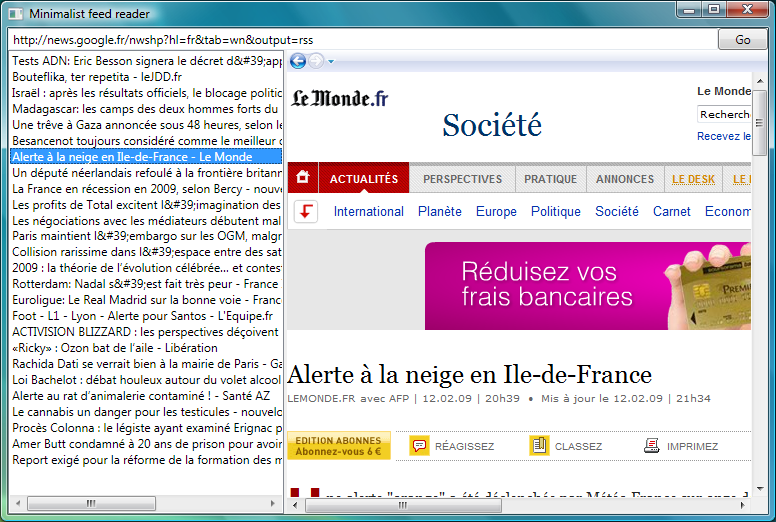

Today, I stumbled upon a very handy class : [SyndicationFeed](http://msdn.microsoft.com/en-us/library/system.servicemodel.syndication.syndicationfeed.aspx). This class, introduced in .NET 3.5, allows to manipulate syndication feeds (like RSS 2.0 or Atom 1.0) with very little code. It can be used to create and publish our own feeds, or to read existing ones.  For instance, here's how to retrieve the news feed from Google News and display its title, its hyperlink, and the titles of it's items :  
```csharp
string url = "http://news.google.fr/nwshp?hl=fr&tab=wn&output=rss";
using (XmlReader reader = XmlReader.Create(url))
{
    SyndicationFeed feed = SyndicationFeed.Load(reader);
    Console.WriteLine(feed.Title.Text);
    Console.WriteLine(feed.Links[0].Uri);
    foreach(SyndicationItem item in feed.Items)
    {
        Console.WriteLine(item.Title.Text);
    }
}
```
  Easy enough, don't you think ? :)  Let's now take advantage of WPF binding capabilities to create a very simple graphical RSS reader :  
```xml
<Window x:Class="TestFeeds.Window1"
        xmlns="http://schemas.microsoft.com/winfx/2006/xaml/presentation"
        xmlns:x="http://schemas.microsoft.com/winfx/2006/xaml"
        Title="Minimalist feed reader" Height="286" Width="531">
    <Grid>
        <Grid.RowDefinitions>
            <RowDefinition Height="Auto"/>
            <RowDefinition Height="*"/>
        </Grid.RowDefinitions>
        <DockPanel Grid.Row="0">
            <Button Name="btnGo"
                    DockPanel.Dock="Right"
                    Width="50"
                    Content="Go"
                    Click="btnGo_Click" />
            <TextBox Name="txtUrl" />
        </DockPanel>
        <Grid Grid.Row="1">
            <Grid.ColumnDefinitions>
                <ColumnDefinition Width="250"/>
                <ColumnDefinition Width="Auto"/>
                <ColumnDefinition Width="*"/>
            </Grid.ColumnDefinitions>
            <ListBox Name="lstFeedItems"
                     Grid.Column="0"
                     DisplayMemberPath="Title.Text" />
            <GridSplitter Grid.Column="1"
                          VerticalAlignment="Stretch"
                          Width="3"
                          ResizeBehavior="PreviousAndNext"
                          ResizeDirection="Columns"/>
            <Frame Name="frmContents"
                   Source="{Binding SelectedItem.Links[0].Uri, ElementName=lstFeedItems}"
                   Grid.Column="2"
                   NavigationUIVisibility="Visible">
            </Frame>
        </Grid>
    </Grid>
</Window>
```
  The code-behind :  
```csharp
    private void btnGo_Click(object sender, RoutedEventArgs e)
    {
        using (XmlReader reader = XmlReader.Create(txtUrl.Text))
        {
            SyndicationFeed feed = SyndicationFeed.Load(reader);
            lstFeedItems.ItemsSource = feed.Items;
        }
    }
```
  And here's the result !  
