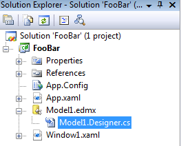
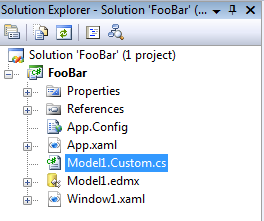

You probably noticed that, in a C# project tree, some items are placed "under" a parent item : it is the case, for instance, for files generated by a designer or wizard :    The following trick shows how to apply the same behavior to your own files.  Let's assume that you want to customize the classes generated by the EDM designer. You can't modify the *Model1.designer.cs* file, because you changes would be overwritten by the designer. So you create a new file, say `Model1.Custom.cs`, where you will write your custom code for the entity classes (using the `partial` keyword). By default, this file is placed at the root of the project :    In order to show clearly the association with *Model1.edmx*, we would like to make *Model1.Custom.cs* a child item of *Model1.edmx*, at the same level as *Model1.designer.cs*... Even though the Visual Studio IDE doesn't offer that option, it is possible : you just need to edit the *.csproj* file manually. The easiest way to do that is to unload the project (right click on the project, "*Unload project*"), and edit it directly in Visual Studio (right click, "*Edit FooBar.csproj*"). Find the `<Compile>` element corresponding to *Model1.Custom.cs*, and add a `<DependentUpon>` child element, as show below :  
```xml
    <Compile Include="Model1.Custom.cs">
        <DependentUpon>Model1.edmx</DependentUpon>
    </Compile>
```
  Reload the project : *Model1.Custom.cs* now appears as a child item of *Model1.edmx*.   This trick enables you to organize your project better and make its structure clearer.

