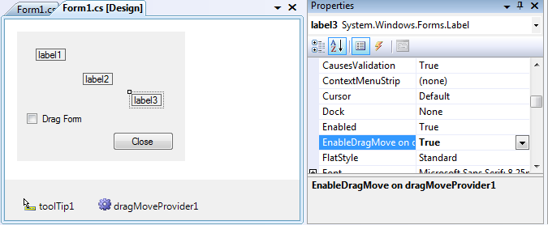

Here's a piece of code I wrote a while ago, I just thought it could be useful for WinForms developers...  In WPF, there is a very handy method to move a window with no borders : `Window.DragMove`. It can be used like that :  
```csharp
        private void Window_MouseDown(object sender, MouseButtonEventArgs e)
        {
            this.DragMove();
        }
```
  When you call this method, the window is moved with the mouse until the button is released. It could hardly be simpler ;)  Unfortunately, this method only exists in WPF, and a majority of developers are still working with Windows Forms. So I came up with a solution to use a similar technique in Windows Forms, with a few improvements : 
- Usable on any control, not only a window
- No need to explicitly handle the `MouseDown` event
- Form designer integration, using a `IExtenderProvider`

My solution consists of the following items :
- a static `DragMoveExtensions` class which provides extension methods for the `Control` class (easily convertible to regular static methods for use with C# 2)
- a `DragMoveProvider` component, which implements `IExtenderProvider` to add a new `EnableDragMove` property to controls

There are several ways to use this solution, pick the one that best suits your needs :
- The simplest, which requires no coding at all : in design mode, drop a `DragMoveProvider` on the Form, and set the `EnableDragMove` property to `true` on the Form or control
- The closest to WPF's DragMove : in the handler of the `MouseDown` event, call the `DragMove` extension method on the Form or control to move

```csharp
        private void label2_MouseDown(object sender, MouseEventArgs e)
        {
            label2.DragMove();
        }
```
- The most flexible : call the `EnableDragMove` extension method on the Form or control to move (no event handling needed).

```csharp
        private void checkBox1_CheckedChanged(object sender, EventArgs e)
        {
            this.EnableDragMove(checkBox1.Checked);
        }
```

  The attached Visual Studio solution contains the WinFormsDragMove library, and a test project to demonstrate the various ways to use this library. A C#2-compatible version of these projects is also included.  [Download source](http://www.thomaslevesque.com/files/2012/06/DragMove.zip)
