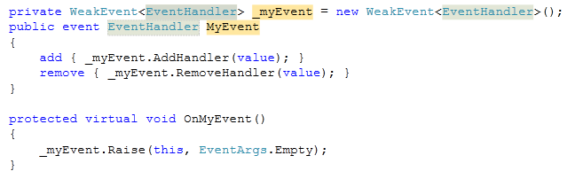

As you probably know, incorrect usage of events is one of the main causes for memory leaks in .NET applications : an event keeps references to its listener objects (through a delegate), which prevents the garbage collector from collecting them when they're not used anymore. This is especially true of static events, because the references are kept for all the lifetime of the application. If the application often adds handlers to the event and never removes them, the memory usage will grow as long as the application runs, until no more memory is available.  The "obvious" solution, of course, is to unsubscribe from the event when you're done with it. Unfortunately, it's not always obvious to know *when* you can unsubscribe... an object that goes out of scope usually isn't aware of it, so it doesn't have a chance to unsubscribe from the event.  Another approach is to implement the [WeakEvent pattern](http://msdn.microsoft.com/en-us/library/aa970850.aspx), which principle is to keep only weak references to the listeners. That way, unsubscribed listeners can be claimed by the garbage collector. Microsoft included in WPF a few types to deal with the WeakEvent pattern (`WeakEventManager` class and `IWeakEventListener` interface), and gives guidelines on how to implement your own weak event. However this technique is not very convenient, because you need to create dedicated classes to expose new events, and the listeners need to implement a specific interface.  So I thought about another implementation, which allows creating weak events almost the same way as normal events. My first idea was to use a list of `WeakReference`s to store the list of subscribed delegates. But this doesn't work so well, because of the way we typically use delegates :  
```csharp

myObject.MyEvent += new EventHandler(myObject_MyEvent);
```
  We create a delegate, subscribe it to the event, and... drop it. So the only accessible reference to the delegate is actually a weak reference, so there's nothing to prevent its garbage collection... and that's exactly what happens ! After a variable period of time (from my observations, no more than a few seconds), the delegate is garbage collected, and isn't called anymore when the event is raised.  Rather than keeping a weak reference to the delegate itself, we should use a less transient object : the target object of the delegate (`Delegate.Target`) would be a better choice. So I created the `WeakDelegate<TDelegate>` class, which wraps a delegate by storing separately the method and a weak reference to the target :  
```csharp

    public class WeakDelegate<TDelegate> : IEquatable<TDelegate>
    {
        private WeakReference _targetReference;
        private MethodInfo _method;

        public WeakDelegate(Delegate realDelegate)
        {
            if (realDelegate.Target != null)
                _targetReference = new WeakReference(realDelegate.Target);
            else
                _targetReference = null;
            _method = realDelegate.Method;
        }

        public TDelegate GetDelegate()
        {
            return (TDelegate)(object)GetDelegateInternal();
        }

        private Delegate GetDelegateInternal()
        {
            if (_targetReference != null)
            {
                return Delegate.CreateDelegate(typeof(TDelegate), _targetReference.Target, _method);
            }
            else
            {
                return Delegate.CreateDelegate(typeof(TDelegate), _method);
            }
        }

        public bool IsAlive
        {
            get { return _targetReference == null || _targetReference.IsAlive; }
        }


        #region IEquatable<TDelegate> Members

        public bool Equals(TDelegate other)
        {
            Delegate d = (Delegate)(object)other;
            return d != null
                && d.Target == _targetReference.Target
                && d.Method.Equals(_method);
        }

        #endregion

        internal void Invoke(params object[] args)
        {
            Delegate handler = (Delegate)(object)GetDelegateInternal();
            handler.DynamicInvoke(args);
        }
    }
```
  Now, we just need to manage a list of these `WeakDelegate<TDelegate>`. This is done by the `WeakEvent<TDelegate>` class :  
```csharp

    public class WeakEvent<TEventHandler>
    {
        private List<WeakDelegate<TEventHandler>> _handlers;

        public WeakEvent()
        {
            _handlers = new List<WeakDelegate<TEventHandler>>();
        }

        public virtual void AddHandler(TEventHandler handler)
        {
            Delegate d = (Delegate)(object)handler;
            _handlers.Add(new WeakDelegate<TEventHandler>(d));
        }

        public virtual void RemoveHandler(TEventHandler handler)
        {
            // also remove "dead" (garbage collected) handlers
            _handlers.RemoveAll(wd => !wd.IsAlive || wd.Equals(handler));
        }

        public virtual void Raise(object sender, EventArgs e)
        {
            var handlers = _handlers.ToArray();
            foreach (var weakDelegate in handlers)
            {
                if (weakDelegate.IsAlive)
                {
                    weakDelegate.Invoke(sender, e);
                }
                else
                {
                    _handlers.Remove(weakDelegate);
                }
            }
        }

        protected List<WeakDelegate<TEventHandler>> Handlers
        {
            get { return _handlers; }
        }
    }
```
  This class automatically handles the removal of "dead" (garbage collected) handlers, and provides a `Raise` method to call the handlers. It can be used as follows :  
```csharp

        private WeakEvent<EventHandler> _myEvent = new WeakEvent<EventHandler>();
        public event EventHandler MyEvent
        {
            add { _myEvent.AddHandler(value); }
            remove { _myEvent.RemoveHandler(value); }
        }

        protected virtual void OnMyEvent()
        {
            _myEvent.Raise(this, EventArgs.Empty);
        }
```
  This is a bit longer to write than a "regular" event, but considering the benefits, it's very acceptable. Anyway, you can easily create a Visual Studio snippet to quickly create a weak event, with only 3 fields to fill in :  
```xml

<?xml version="1.0" encoding="utf-8" ?>
<CodeSnippets  xmlns="http://schemas.microsoft.com/VisualStudio/2005/CodeSnippet">
  <CodeSnippet Format="1.0.0">
    <Header>
      <Title>wevt</Title>
      <Shortcut>wevt</Shortcut>
      <Description>Code snippet for a weak event</Description>
      <Author>Thomas Levesque</Author>
      <SnippetTypes>
        <SnippetType>Expansion</SnippetType>
      </SnippetTypes>
    </Header>
    <Snippet>
      <Declarations>
        <Literal>
          <ID>type</ID>
          <ToolTip>Event type</ToolTip>
          <Default>EventHandler</Default>
        </Literal>
        <Literal>
          <ID>event</ID>
          <ToolTip>Event name</ToolTip>
          <Default>MyEvent</Default>
        </Literal>
        <Literal>
          <ID>field</ID>
          <ToolTip>Name of the field holding the registered handlers</ToolTip>
          <Default>_myEvent</Default>
        </Literal>
      </Declarations>
      <Code Language="csharp">
        <![CDATA[private WeakEvent<$type$> $field$ = new WeakEvent<EventHandler>();
        public event $type$ $event$
        {
            add { $field$.AddHandler(value); }
            remove { $field$.RemoveHandler(value); }
        }

        protected virtual void On$event$()
        {
            $field$.Raise(this, EventArgs.Empty);
        }$end$]]>
      </Code>
    </Snippet>
  </CodeSnippet>
</CodeSnippets>
```
  This snippet gives the following result in Visual Studio :  
