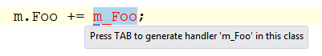

Visual Studio 2012 RC is out since last week, and even though I didn’t have much time to play with it yet, I think I like it so far. Lots of things have already been said about the design, and about the most important new features, but there are also many smaller and less remarkable improvements that make life easier for us. Since I have seen little or nothing written about those, I thought I would make a list of what I noticed so far.

### Better *Edit and Continue*: improved debug experience with anonymous methods

*Edit and continue* is a very useful feature that has been present in Visual Studio for a long time. It’s great when you need to fix some code in the middle of a step-by-step debugging session without restarting the application completely. This feature has always had a limitation: you couldn’t use it in a method that contained an anonymous method:

> Modifying a ’method’ which contains a lambda expression will prevent the debug session from continuing while Edit and Continue is enabled.

Before .NET 3.5, it wasn’t really a problem since anonymous methods were not very common, but since Linq was introduced and lambda expressions became more widely used, this limitation began to grow more and more annoying.

Well, good news: Visual Studio 2012 fixed that! You can now use *Edit and Continue* in a method that contains lambda expressions or Linq queries. Note that the limitation hasn’t completely disappeared: you still can’t modify a *statement* that contains an anonymous method. Note the slightly different error message:

> Modifying a statement which contains a lambda expression will prevent the debug session from continuing while Edit and Continue is enabled.

But you can modify everything else in the method body, which is a great improvement. Note that editing a method that contains anonymous types is also supported, as long as you don’t modify the anonymous type itself.

### Optimized event handler autocompletion

Visual Studio has a nice autocompletion feature that allow you to generate an event handler automatically when you type `+=` and <kbd>Tab</kbd> after an event name :

But the `new EventHandler(…)` part is redundant, because since C# 2, method groups are implicitly convertible to compatible delegate types. Visual Studio 2012 fixes this and generates the shorter form:

OK, this is a very small change, but the previous behavior was really annoying me… I had actually [suggested this improvement on Connect](http://connect.microsoft.com/VisualStudio/feedback/details/632300/auto-generated-event-handlers-should-use-implicit-conversion-of-method-group-to-delegate), so I’m glad to see that it was implemented.

### Improved *Find/Replace*

The *Find* dialog in Visual Studio had not seen any improvement for as long as I can remember (probably since VS2003 or VS2005), so it was time for a change… In VS2012, it has been replaced with the Quick Find feature from the [Productivity Power Tools extension](http://visualstudiogallery.msdn.microsoft.com/d0d33361-18e2-46c0-8ff2-4adea1e34fef). It appears as a small panel in the top right corner of the text editor, much less obtrusive than the old dialog:

It provides the following features:

- incremental search (matches are highlighted as you type in the search box)
- quick access to options such as match case, match whole word, or regex through the search field dropdown
- support for .NET regular expressions (the old *Find* dialog was using a different kind of regex, not fully compatible with the .NET regex syntax)

If for some reason you need the full *Find* dialog, it’s still there: there’s a menu item to access it in the search field dropdown.

### Quick launch

> Where’s that command again? In the Debug menu or the Project menu? I can’t remember, and I don’t know the keyboard shortcut…

Sounds familiar? For me it does… Visual Studio has so many features that sometimes it can be hard to find what you’re looking for. That’s why the new *Quick Access* feature is a very welcome addition; it appears as a search box in the top right corner of the IDE, and allows you to type what you want to do:

Again, this feature comes from the Productivity Power Tools extension, and has been included in Visual Studio itself. It has also been given a more prominent place in the IDE (in VS2010 it was only accessible through the <kbd>Ctrl+Q</kbd> shortcut).

### Smarter Solution Explorer

The Solution Explorer used to show only the files in your project, but nothing about what was in the files; If you want to see the classes and members, you had to switch to the Class View. Visual Studio 2012 changes that: now you can see what is declared in a file, just by expanding the node in the Solution Explorer:

This feature had been in Eclipse for a long time, so it was time for Visual Studio to catch up .

A few other interesting features of the new Solution Explorer:

- Scope to This: allows to re-root the tree to a specific node (e.g. if you want to see only the content of a folder). The re-rooted tree can be viewed in a separate view.
- Pending Changes Filter: show only pending changes (if source control is active for the current project)
- Open Files Filter: show only open files
- Sync With Active Document: quickly locate the current document in the Solution Explorer (*very* useful for large solutions)

And yes, that’s yet another feature that comes from Productivity Power Tools (it was known as the *Solution Navigator*), with a few improvements.

### ALL CAPS MENUS

Menus in VS2012 are in ALL CAPS, and it’s not exactly the most popular change… there has been tons of negative feedback about this! Frankly, I’m a bit surprised that people pay so much importance to such an insignificant detail, when there are so many more important things to discuss. Personally, I found it a bit unsettling when I saw the first screenshots, but when I got my hands on the RC I found that it didn’t bother me at all. I guess most people will just get used to it in the end…

Anyway, the reason I mention this is to say that if you really don’t like the ALL CAPS menus, you can get the normal casing back with a simple registry tweak. Just open regedit, go to the `HKEY_CURRENT_USER\Software\Microsoft\VisualStudio\11.0\General` key, create a DWORD value named `SuppressUppercaseConversion` and set it to 1.

