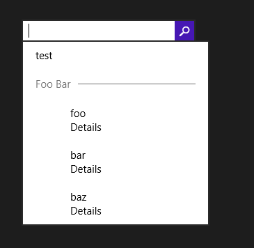

Today I ran into a strange problem that made me waste an hour or two, so I thought I’d write about it in case someone else faces the same issue.

The [`SearchBox`](http://msdn.microsoft.com/library/windows/apps/dn252771) control was introduced in Windows 8.1 to enable search scenarios from within a Windows Store app. One of its features is that it can show suggestions based on user input. There are three kinds of suggestions:

- History suggestions are search queries previously entered by the user. This is handled automatically, so you don’t need to write any code for it to work.
- Search suggestions allow you to provide search terms based on user input; if the user selects one, the current query text will be replaced with the text of the suggestion, and submitting the query will start the search.
- Result suggestions are suggestions for exact results. The user can select one of these results directly without actually starting a full search.


To provide suggestions, you need to handle the [`SuggestionsRequested`](http://msdn.microsoft.com/en-us/library/windows/apps/windows.ui.xaml.controls.searchbox.suggestionsrequested) event of the `SearchBox`, and add suggestions using the [`AppendQuerySuggestion`](http://msdn.microsoft.com/en-us/library/windows/apps/windows.applicationmodel.search.searchsuggestioncollection.appendquerysuggestion) and [`AppendResultSuggestion`](http://msdn.microsoft.com/en-us/library/windows/apps/hh700542) methods. Let’s focus on result suggestions.

The `AppendResultSuggestion` method takes several parameters, and one of them is the image to display for the suggestion. It is mandatory (passing null will throw an exception), and the parameter is of type [`IRandomAccessStreamReference`](http://msdn.microsoft.com/en-us/library/windows/apps/windows.storage.streams.irandomaccessstreamreference), i.e. something that can provide a stream. I find this a little peculiar, since it would be more natural to pass an `ImageSource`, but that’s the way it is… So I looked for a class that implements the `IRandomAccessStreamReference` interface, and the first obvious candidate I found was `StorageFile`, which represents a file. So I wrote the following code:

```csharp
private async void SearchBox_SuggestionsRequested(SearchBox sender, SearchBoxSuggestionsRequestedEventArgs args)
{
    var deferral = args.Request.GetDeferral();
    try
    {
        var imageUri = new Uri("ms-appx:///test.png");
        var imageRef = await StorageFile.GetFileFromApplicationUriAsync(imageUri);
        args.Request.SearchSuggestionCollection.AppendQuerySuggestion("test");
        args.Request.SearchSuggestionCollection.AppendSearchSeparator("Foo Bar");
        args.Request.SearchSuggestionCollection.AppendResultSuggestion("foo", "Details", "foo", imageRef, "Result");
        args.Request.SearchSuggestionCollection.AppendResultSuggestion("bar", "Details", "bar", imageRef, "Result");
        args.Request.SearchSuggestionCollection.AppendResultSuggestion("baz", "Details", "baz", imageRef, "Result");
    }
    finally
    {
        deferral.Complete();
    }
}
```

This code runs without any error, and the suggestions are displayed… but the image is not shown!



I spent a long time double-checking everything, making lots of minor changes to try and locate the issue, I even wrote a custom implementation of `IRandomAccessStreamReference`… to no avail.

I eventually [submitted the problem to Stack Overflow](http://stackoverflow.com/questions/19769689/image-not-shown-for-result-suggestions-in-searchbox), and someone kindly provided the solution, which was very simple: instead of `StorageFile`, use [`RandomAccessStreamReference`](http://msdn.microsoft.com/en-us/library/windows/apps/windows.storage.streams.randomaccessstreamreference) (seems pretty obvious once you know that it exists). The code now becomes :

```csharp
private void SearchBox_SuggestionsRequested(SearchBox sender, SearchBoxSuggestionsRequestedEventArgs args)
{
    var imageUri = new Uri("ms-appx:///test.png");
    var imageRef = RandomAccessStreamReference.CreateFromUri(imageUri);
    args.Request.SearchSuggestionCollection.AppendQuerySuggestion("test");
    args.Request.SearchSuggestionCollection.AppendSearchSeparator("Foo Bar");
    args.Request.SearchSuggestionCollection.AppendResultSuggestion("foo", "Details", "foo", imageRef, "Result");
    args.Request.SearchSuggestionCollection.AppendResultSuggestion("bar", "Details", "bar", imageRef, "Result");
    args.Request.SearchSuggestionCollection.AppendResultSuggestion("baz", "Details", "baz", imageRef, "Result");
}
```

(Note that the method is not asynchronous anymore, so there is no need to use the deferral object).

The suggestions are now displayed as expected, with the image:


So, the lesson of this story is that even though the `image` parameter is of type `IRandomAccessStreamReference`, **it doesn’t seem to accept anything other than an instance of the `RandomAccessStreamReference` class**. If you pass any other implementation of the interface, it just fails silently and the image is not shown. This is obviously a bug: if the parameter type in the method signature is an interface, it should accept any implementation of that interface, not just a specific implementation; if it doesn’t, it should be declared of the concrete type. I submitted the [bug](https://connect.microsoft.com/VisualStudio/feedback/details/807704/searchbox-windows-8-1-doesnt-show-the-image-if-it-is-not-an-instance-of-randomaccessstreamreference) to Connect, hopefully it will be fixed in a future version.

I hope this helps someone!

