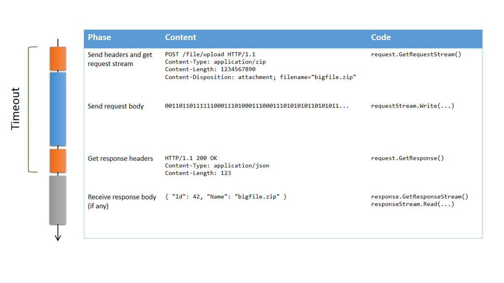
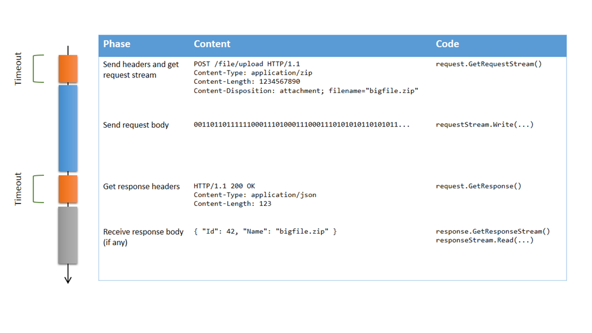

If you ever had to upload large volumes of data over HTTP, you probably ran into timeout issues. The default `Timeout` value for `HttpWebRequest` is 100 seconds, which means that if it takes more than that from the time you send the request headers to the time you receive the response headers, your request will fail. Obviously, if you’re uploading a large file, you need to increase that timeout… but to which value?  If you know the available bandwidth, you could calculate a rough estimate of how long it should take to upload the file, but it’s not very reliable, because if there is some network congestion, it will take longer, and your request will fail even though it could have succeeded given enough time. So, should you set the timeout to a very large value, like several hours, or even [Timeout.Infinite](http://msdn.microsoft.com/en-us/library/system.threading.timeout.infinite.aspx)? Probably not. The most compelling reason is that even though the transfer itself could take hours, some phases of the exchange shouldn’t take that long. Let’s decompose the phases of an HTTP upload:    Obtaining the request stream or getting the response (orange parts) isn’t supposed to take very long, so obviously we need a rather short timeout there (the default value of 100 seconds seems reasonable). But sending the request body (blue part) could take much longer, and there is no reliable way  to decide how long that should be; as long as we keep sending data and the server is receiving it, there is no reason not to continue, even if it’s taking hours. So we actually don’t want a timeout at all there! Unfortunately, the behavior of the `Timeout` property is to consider everything from the call to `GetRequestStream` to the return of `GetResponse`…  In my opinion, it’s a design flaw of the `HttpWebRequest` class, and one that has bothered me for a very long time. So I eventually came up with a solution. It relies on the fact that the asynchronous versions of `GetRequestStream` and `GetResponse` don’t have a timeout mechanism. Here’s what the documentation says: 

> *The Timeout property has no effect on asynchronous requests made with the BeginGetResponse or BeginGetRequestStream method.**In the case of asynchronous requests, the client application implements its own time-out mechanism. Refer to the example in the BeginGetResponse method.*

 So, a solution could be to to use these methods directly (or the new `Task`-based versions: `GetRequestStreamAsync` and `GetResponseAsync`); but more often than not, you already have an existing code base that uses the synchronous methods, and changing the code to make it fully asynchronous is usually not trivial. So, the easy approach is to create synchronous wrappers around `BeginGetRequestStream` and `BeginGetResponse`, with a way to specify a timeout for these operations: 
```csharp
    public static class WebRequestExtensions
    {
        public static Stream GetRequestStreamWithTimeout(
            this WebRequest request,
            int? millisecondsTimeout = null)
        {
            return AsyncToSyncWithTimeout(
                request.BeginGetRequestStream,
                request.EndGetRequestStream,
                millisecondsTimeout ?? request.Timeout);
        }

        public static WebResponse GetResponseWithTimeout(
            this HttpWebRequest request,
            int? millisecondsTimeout = null)
        {
            return AsyncToSyncWithTimeout(
                request.BeginGetResponse,
                request.EndGetResponse,
                millisecondsTimeout ?? request.Timeout);
        }

        private static T AsyncToSyncWithTimeout<T>(
            Func<AsyncCallback, object, IAsyncResult> begin,
            Func<IAsyncResult, T> end,
            int millisecondsTimeout)
        {
            var iar = begin(null, null);
            if (!iar.AsyncWaitHandle.WaitOne(millisecondsTimeout))
            {
                var ex = new TimeoutException();
                throw new WebException(ex.Message, ex, WebExceptionStatus.Timeout, null);
            }
            return end(iar);
        }
    }
```
 (note that I used the Begin/End methods rather than the Async methods, in order to keep compatibility with older versions of .NET)  These extension methods can be used instead of `GetRequestStream` and `GetResponse`; each of them will timeout if they take too long, but once you have the request stream, you can take as long as you want to upload the data. Note that the stream itself has its own read and write timeout (5 minutes by default), so if 5 minutes go by without any data being uploaded, the Write method will cause an exception. Here is the new upload scenario using these methods:    As you can see, the only difference is that the timeout doesn't apply anymore to the transfer of the request body, but only to obtaining the request stream and getting the response. Here’s a full example that corresponds to the scenario above: 
```csharp
long UploadFile(string path, string url, string contentType)
{
    // Build request
    var request = (HttpWebRequest)WebRequest.Create(url);
    request.Method = WebRequestMethods.Http.Post;
    request.AllowWriteStreamBuffering = false;
    request.ContentType = contentType;
    string fileName = Path.GetFileName(path);
    request.Headers["Content-Disposition"] = string.Format("attachment; filename=\"{0}\"", fileName);
    
    try
    {
        // Open source file
        using (var fileStream = File.OpenRead(path))
        {
            // Set content length based on source file length
            request.ContentLength = fileStream.Length;
            
            // Get the request stream with the default timeout
            using (var requestStream = request.GetRequestStreamWithTimeout())
            {
                // Upload the file with no timeout
                fileStream.CopyTo(requestStream);
            }
        }
        
        // Get response with the default timeout, and parse the response body
        using (var response = request.GetResponseWithTimeout())
        using (var responseStream = response.GetResponseStream())
        using (var reader = new StreamReader(responseStream))
        {
            string json = reader.ReadToEnd();
            var j = JObject.Parse(json);
            return j.Value<long>("Id");
        }
    }
    catch (WebException ex)
    {
        if (ex.Status == WebExceptionStatus.Timeout)
        {
            LogError(ex, "Timeout while uploading '{0}'", fileName);
        }
        else
        {
            LogError(ex, "Error while uploading '{0}'", fileName);
        }
        throw;
    }
}
```
 I hope you will find this helpful!

