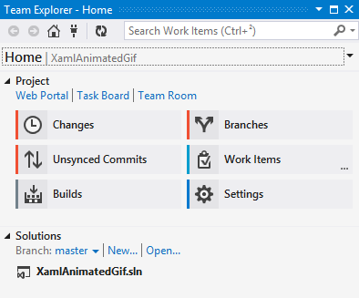

I recently started using Visual Studio Online for personal projects, and I must say it’s a pretty good platform, although it would be nice to be able to host public projects as well as private ones. The thing I like the most is the integration with Visual Studio Team Explorer to manage work items and builds.

However, I noticed a little gotcha when using Git for source control : the remote for VS Online **must** be named `origin`, otherwise Team Explorer won’t detect that it’s a VS Online project, and it won’t show the “Builds” and “Work items” pages.

 


This is obviously a bug (although a minor one), since the name `origin` is just a convention and a git remote can have any name; I reported it [on Connect](https://connect.microsoft.com/VisualStudio/feedback/details/998359/visual-studio-online-git-integration-in-team-explorer-doesnt-work-if-the-remote-for-vso-isnt-named-origin). If you encounter it you can easily work around it by renaming your remote to `origin`:

```
git remote rename vso origin
```

