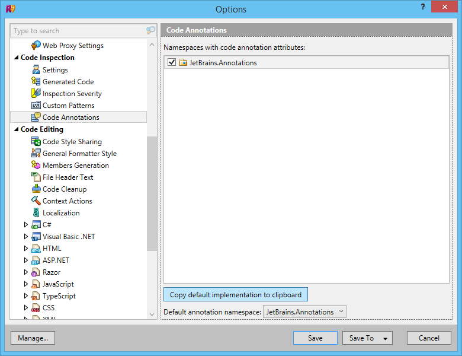
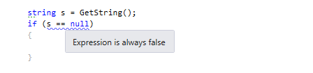
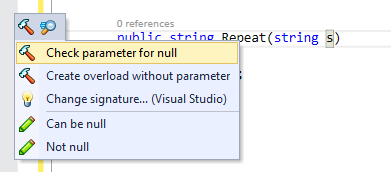
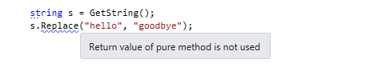
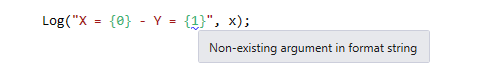
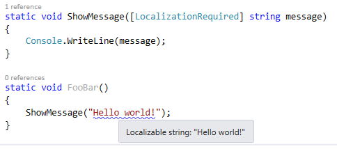

I don’t think it’s really necessary to present [ReSharper](https://www.jetbrains.com/resharper/) (often abbreviated R#), but in case you don’t know about it, it’s a tool made by JetBrains that performs real-time analysis of your C# or VB.NET code to warn you about possible bugs, bad practices, convention violations, etc. It also provides many useful refactorings and code generators. I’ve been using it for a few years now, and it has tremendously improved both my productivity and my coding style.

Among other things, R# warns you about incorrect usage of .NET Framework methods. For instance, if you’re calling `Path.GetFullPath` with a path that might be null, it gives you a warning:


How does R# know that `Path.GetFullName` doesn’t accept a null argument? And how does it know that `Console.ReadLine` can return null? I guess it could have been hard-coded, but it wouldn’t be a very elegant approach, and wouldn’t allow easy extensibility… Instead, ReSharper uses [external annotations](https://www.jetbrains.com/resharper/webhelp80/Code_Analysis__External_Annotations.html). These are XML files that are shipped with R# and contain a lot of metadata about .NET framework classes and methods. This data is then used by the analyzer to detect possible issues with your code.

OK, but what about third-party libraries? Obviously, JetBrains can’t create annotations for those, there are too many. Well, the good news is that you can write your own external annotations for libraries that you use, or for your own code. However, for your own code, there is a much more convenient alternative: you can apply the annotations directly in your code as attributes. There are two ways to get those attributes:

- Reference the assembly where they are defined (JetBrains.Annotations.dll in the R# installation directory). This is fine if you don’t mind having a reference to something that has nothing to do with your application. That’s probably not a good idea for libraries.
- Declare the attributes in your own code. You don’t actually have to write them yourself, because R# has an option to copy their implementation to the clipboard, as shown below. You just paste it to a code file in your project.




Now that you have the attributes, how do you use them? I’ll show a few examples for the most common annotations.

### NotNull

This annotation indicates that the element on which it is applied cannot, or must not be null.

If you apply it to a method or property, it means that the method or property will never return null:


```
        [NotNull]
        public string GetString()
        {
            return "Hello world!";
        }
```

When a method has this attribute, if you test if the return value is null (or not null), R# will warn you that the condition is always false (or true):




If you apply it to a method parameter, it means that null is not a valid argument value:

```
        public string Repeat([NotNull] string s)
        {
            if (s == null) throw new ArgumentNullException("s");
            return s + s;
        }
```

If R# determines that the value passed for `s` can be null, it warns you about it, as shown in the first example.

This annotation can be added automatically using ReSharper’s quick-fix menu. The “Not null” option will just add the annotation; the “Check parameter for null” option will add a check and the annotation:



### 


### CanBeNull

This is the opposite of `NotNull`. Applied to a method or property, it means that the method or property can return a null value. Applied to a method parameter, it means that the argument value is allowed to be null.

### Pure

This one is very useful. Applied to a method, it means that the method is [pure](https://en.wikipedia.org/wiki/Pure_function). A pure method has no observable side effect, so if you don’t use the return value of the method, the call is useless, so it’s probably a mistake. Typical example with `String.Replace`:



###  

### StringFormatMethod

This annotation indicates that a method works like the `String.Format` method, i.e. it takes a composite format string followed by arguments that will replace the placeholders in the format string:

```
        [StringFormatMethod("format")]
        public static void Log(string format, params object[] args)
        {
            ...
        }
```

It lets R# warn you if the placeholders and arguments don’t match:



### UsedImplicitly

This one tells ReSharper that a code element is used, even though R# cannot statically detect it. It has the effect of suppressing the *“(…) is never used”* warning. It’s useful, for instance, when a type or member is used only via reflection.

### NoEnumeration

This annotation is applied to an `IEnumerable` parameter, and means that the method will not enumerate the sequence. R# warns you when you enumerate an `IEnumerable` multiple times, so using this attribute prevents false positives for this warning:


```
        public static IEnumerable<T> EmptyIfNull<T>([NoEnumeration] this IEnumerable<T> source)
        {
            return source ?? Enumerable.Empty<T>();
        }
```


### InstantHandle

This one is applied to a delegate parameter, and means that the delegate will be executed during the execution of the method. It prevents the *“Access to modified closure”* warning that occurs when a lambda captures a variable that is later modified.

### ContractAnnotation

This annotation is a powerful way to describe how the output of a method depends on its inputs. It lets R# predict how the method will behave. For instance, this method will return null if its argument is null, an not null otherwise:


```
        [ContractAnnotation("null => null; notnull => notnull")]
        public object Transform(object data)
        {
            ...
        }
```

Thanks to the annotation, ReSharper will know that if the argument was not null, the result will not be null either.

This method doesn’t return normally (it throws an exception) if its argument is null:

```
        [ContractAnnotation("value:null => halt")]
        public static void CheckArgumentNull<T>(
            [NoEnumeration] this T value,
            [InvokerParameterName] string paramName)
            where T : class
        {
            if (value == null)
                throw new ArgumentNullException(paramName);
        }
```

This lets R# know that if you pass a null to this method, the code following the call will never be reached; if it is reached, the value can be assumed to be not null.

### LocalizationRequired

This annotation means that a property or method parameter should be localized; if you pass a hard-coded string, R# will warn you and suggest to extract it to a resource file.



## Conclusion

Now, you might be wondering, “why should I go through the trouble of adding all those annotations to my code?”. The reason is simple: it helps ReSharper help you! By giving it more information about your code, you allow R# to give you better advice and produce less false positives. Also, if you’re a library author, it makes your library more comfortable to use for ReSharper users. I use R# annotations extensively in my [Linq.Extras](https://github.com/thomaslevesque/Linq.Extras) library, so it’s a good place to find more examples.

Note that I only described a small part of the available annotations. There are many more, mostly related to ASP.NET-specific scenarios. You can see them all in the annotations file generated by ReSharper, or in the [documentation](https://www.jetbrains.com/resharper/webhelp80/Reference__Code_Annotation_Attributes.html) (which isn’t quite complete, but is still useful).

