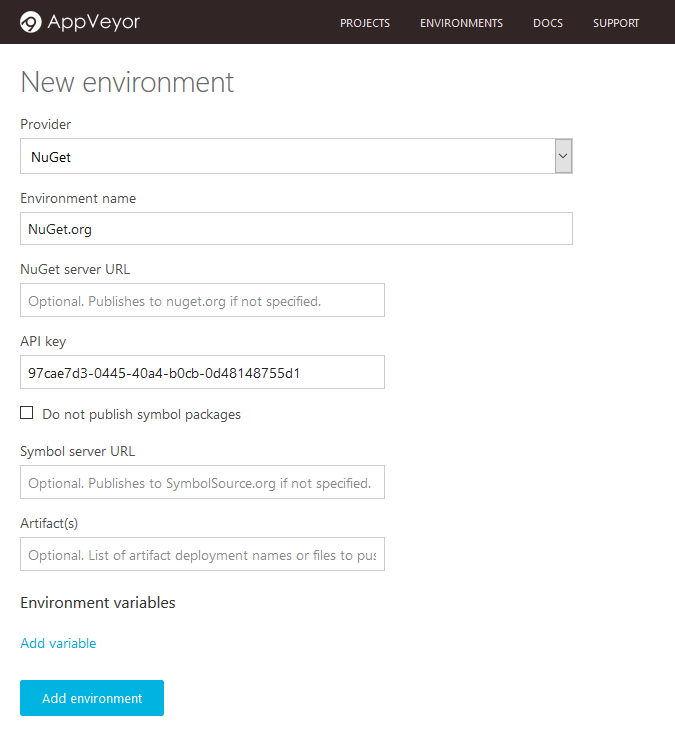

In the last few months, I’ve been using [AppVeyor CI](https://ci.appveyor.com/) on some of my open-source projects (along with [Cake](http://cakebuild.net/) for the build scripts). I really like it, but one thing bothered me: I couldn’t find a way to manually publish packages to NuGet.org directly from AppVeyor. I had to download the package locally, then upload it manually from my machine (either with `nuget push` on the command line, or via the web form on NuGet.org), which is always error-prone.

The solution turned out to be pretty easy, once I knew where to look. I’ll describe the steps here.

### Initial configuration

**1. Configure NuGet.org as a deployment environment**

Before you can push packages to the NuGet gallery, you need to configure NuGet.org as a deployment environment (you only need to do this once, unless you want to publish under multiple identities).

Once logged in to AppVeyor, go to the *Environments* page, click *New Environment*, and select *NuGet* as the deployment provider:

Choose a name for the environment (e.g. NuGet.org) and enter your API Key (no, it’s not my real key in the screenshot…). You can find your NuGet API key on your account page on NuGet.org when you’re logged in. Just leave the URL empty if you want to deploy to the official NuGet gallery. When you’re done, click *Add environment*.

**2. Configure artifacts in your project**

In your project settings, make sure the NuGet packages generated by your build process are configured as artifacts. You just need to add the path to the .nupkg files (the deployment name is optional):

That’s all! You’re now ready to publish.

### Publishing packages

Start a new build, and when it’s complete, click on the *Deploy* button for this build:

Select Nuget.org as the deployment environment:

Click *Deploy*, and wait for the magic to happen. If everything goes smoothly, you should see something like this:

Congratulations, your package is now on the NuGet gallery. Go there and check!

