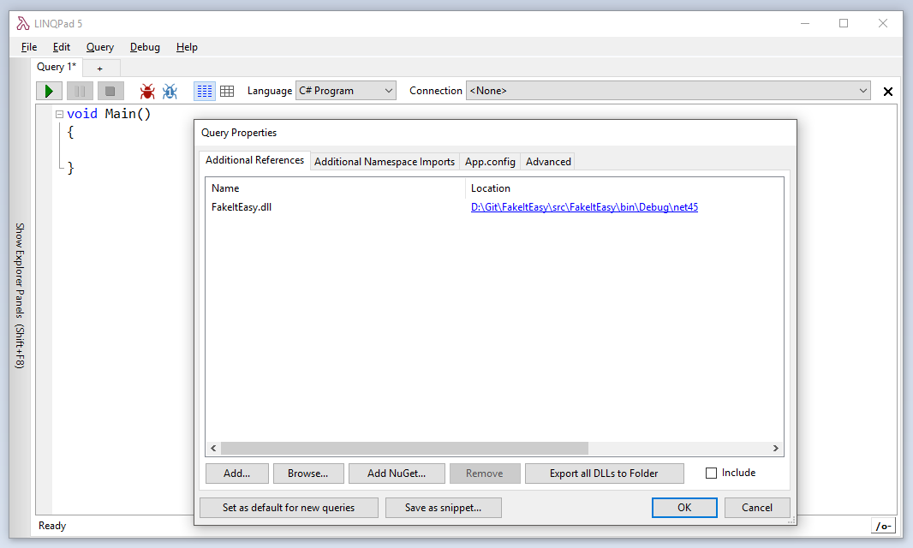
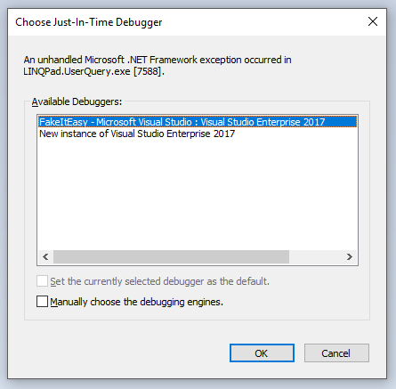

I've been meaning to blog about [LINQPad](http://www.linqpad.net/) in a very long time. In case you don't know about it, LINQPad is a tool that lets you write and test code very quickly without having to create a full-blown project in Visual Studio. It supports C#, VB.NET, F# and SQL. It was initially intended as an educational tool to experiment with LINQ (its author, Joe Albahari, developed it as companion to his *C# in a Nutshell* book), but it's also extremely useful as a general-purpose .NET scratchpad.

I frequently use LINQPad to quickly test a library that I'm working on. It's very easy, just reference the assembly you want to test and start using it. But when the library doesn't behave as expected, it's often useful to be able to debug it step by step... It turns out that it's pretty simple to do it from LINQPad!

The premium version of LINQPad has an integrated debugger, which isn't as powerful as the one in Visual Studio, but is useful to debug LINQPad scripts. However, it doesn't let you step into library code... Fortunately, there's a trick to use the Visual Studio debugger to debug code running from LINQPad.

First, open your library in Visual Studio if you haven't already. Build the solution, and add a reference to the assembly to your LINQPad script:



Write some code that uses your library:


And add this line at the beginning of your LINQPad script:

```csharp
Debugger.Launch();
```

When you run the script, it will open a dialog window prompting you to choose a debugger:



Select the Visual Studio instance in which your solution is loaded and click OK. This will attach the Visual Studio debugger to the process that is running the LINQPad script, and pause the execution on the call to `Debugger.Launch()`:


You can now debug the LINQPad script *and* your library code. You can set breakpoints, step into methods, add watches, etc, just as when debugging a normal application!

