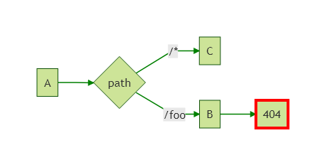

## Middlewhat?

The ASP.NET Core architecture features a system of **middleware**, which are pieces of code that handle requests and responses. Middleware are chained to each other to form a **pipeline**. Incoming requests are passed through the pipeline, where each middleware has a chance to do something with them before passing them to the next middleware. Outgoing responses are also passed through the pipeline, in reverse order. If this sounds very abstract, the following schema from the [official ASP.NET Core documentation](https://docs.microsoft.com/en-us/aspnet/core/fundamentals/middleware) should help you understand:


Middleware can do all sort of things, such as handling authentication, errors, static files, etc... MVC in ASP.NET Core is also implemented as a middleware.

## Configuring the pipeline

You typically configure the ASP.NET pipeline in the `Configure` method of your `Startup` class, by calling `Use*` methods on the `IApplicationBuilder`. Here's an example straight from the docs:

```csharp

public void Configure(IApplicationBuilder app)
{
    app.UseExceptionHandler("/Home/Error");
    app.UseStaticFiles();
    app.UseAuthentication();
    app.UseMvcWithDefaultRoute();
}
```

Each `Use*` method adds a middleware to the pipeline. The order in which they're added determines the order in which requests will traverse them. So an incoming request will first traverse the exception handler middleware, then the static files middleware, then the authentication middleware, and will eventually be handled by the MVC middleware.

The `Use*` methods in this example are actually just "shortcuts" to make it easier to build the pipeline. Behind the scenes, they all end up using (directly or indirectly) these low-level primitives: `Use` and `Run`. Both add a middleware to the pipeline, the difference is that `Run` adds a *terminal* middleware, i.e. a middleware that is the last in the pipeline.

## A basic pipeline with no branches

Let's look at a simple example, using only the `Use` and `Run` primitives:

```csharp

public void Configure(IApplicationBuilder app)
{
    // Middleware A
    app.Use(async (context, next) =>
    {
        Console.WriteLine("A (before)");
        await next();
        Console.WriteLine("A (after)");
    });

    // Middleware B
    app.Use(async (context, next) =>
    {
        Console.WriteLine("B (before)");
        await next();
        Console.WriteLine("B (after)");
    });

    // Middleware C (terminal)
    app.Run(async context =>
    {
        Console.WriteLine("C");
        await context.Response.WriteAsync("Hello world");
    });
}
```

Here, each middleware is defined inline as an anonymous method; they could also be defined as full-blown classes, but for this example I picked the more concise option. Non-terminal middleware take two arguments: the `HttpContext` and a delegate to call the next middleware. Terminal middleware only take the `HttpContext`. Here we have two middleware A and B that just log to the console, and a terminal middleware C which writes the response. Here's the console output when we send a request to our app:

```text

A (before)
B (before)
C
B (after)
A (after)
```

We can see that each middleware was traversed in the order in which it was added, then traversed again in reverse order. The pipeline can be represented like this:


## Short-circuiting middleware

A middleware doesn't necessarily have to call the next middleware. For instance, if the static files middleware can handle a request, it doesn't need to pass it down to the rest of the pipeline, it can respond immediately. This behavior is called short-circuiting the pipeline.

In the previous example, if we comment out the call to `next()` in middleware B, we get the following output:

```text

A (before)
B (before)
B (after)
A (after)
```

As you can see, middleware C is never invoked. The pipeline now looks like this:


## Branching the pipeline

In the previous examples, there was only one "branch" in the pipeline: the middleware coming after A was always B, and the middleware coming after B was always C. But it doesn't have to be that way. You might want a given request to be processed by a completely different pipeline, based on the path or anything else.

There are two types of branches: branches that rejoin the main pipeline, and branches that don't.

### Making a non-rejoining branch

This can be done using the `Map` or `MapWhen` method. `Map` lets you specify a branch based on the request path. `MapWhen` gives you more control: you can specify a predicate on the `HttpContext` to decide whether to branch or not. Let's look at a simple example using `Map`:

```csharp

public void Configure(IApplicationBuilder app)
{
    app.Use(async (context, next) =>
    {
        Console.WriteLine("A (before)");
        await next();
        Console.WriteLine("A (after)");
    });

    app.Map(
        new PathString("/foo"),
        a => a.Use(async (context, next) =>
        {
            Console.WriteLine("B (before)");
            await next();
            Console.WriteLine("B (after)");
        }));

    app.Run(async context =>
    {
        Console.WriteLine("C");
        await context.Response.WriteAsync("Hello world");
    });
}
```

The first argument for `Map` is a `PathString` representing the path prefix of the request. The second argument is a delegate that configures the branch's pipeline (the `a` parameter represents the `IApplicationBuilder` for the branch). The branch defined by the delegate will process the request if its path starts with the specified path prefix.

For a request that doesn't start with `/foo`, this code produces the following output:

```text

A (before)
C
A (after)
```

Middleware B is not invoked, since it's in the branch and the request doesn't match the prefix for the branch. But for a request that does start with `/foo`, we get the following output:

```text

A (before)
B (before)
B (after)
A (after)
```

Note that this request returns a 404 (Not found) response: this is because the B middleware calls `next()`, but there's no next middleware, so it falls back to returning a 404 response. To solve this, we could use `Run` instead of `Use`, or just not call `next()`.

The pipeline defined by this code can be represented as follows:



(I omited the response arrows for clarity)

As you can see, the branch with middleware B doesn't rejoin the main pipeline, so middleware C isn't called.

### Making a rejoining branch

You can make a branch that rejoins the main pipeline by using the `UseWhen` method. This method accepts a predicate on the `HttpContext` to decide whether to branch or not. The branch will rejoin the main pipeline where it left it. Here's an example similar to the previous one, but with a rejoining branch:

```csharp

public void Configure(IApplicationBuilder app)
{
    app.Use(async (context, next) =>
    {
        Console.WriteLine("A (before)");
        await next();
        Console.WriteLine("A (after)");
    });

    app.UseWhen(
        context => context.Request.Path.StartsWithSegments(new PathString("/foo")),
        a => a.Use(async (context, next) =>
        {
            Console.WriteLine("B (before)");
            await next();
            Console.WriteLine("B (after)");
        }));

    app.Run(async context =>
    {
        Console.WriteLine("C");
        await context.Response.WriteAsync("Hello world");
    });
}
```

For a request that doesn't start with `/foo`, this code produces the same output as the previous example:

```text

A (before)
C
A (after)
```

Again, middleware B is not invoked, since it's in the branch and the request doesn't match the predicate for the branch. But for a request that does start with `/foo`, we get the following output:

```text

A (before)
B (before)
C
B (after)
A (after)
```

We can see that the request passes trough the branch (middleware B), then goes back to the main pipeline, ending with middleware C. This pipeline can be represented like this:


Note that there is no `Use` method that accepts a `PathString` to specify the path prefix. I'm not sure why it's not included, but it would be easy to write, using `UseWhen`:

```csharp

public static IApplicationBuilder Use(this IApplicationBuilder builder, PathString pathMatch, Action<IApplicationBuilder> configuration)
{
    return builder.UseWhen(
        context => context.Request.Path.StartsWithSegments(pathMatch),
        configuration);
}
```

## Conclusion

As you can see, the idea behind the middleware pipeline is quite simple, but it's very powerful. Most of the features baked in ASP.NET Core (authentication, static files, caching, MVC, etc) are implemented as middleware. And of course, it's easy to write your own!

