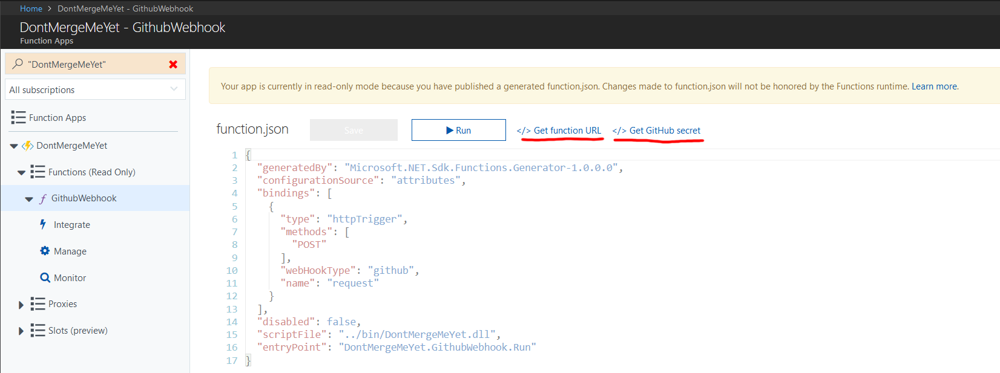

I recently experimented with Azure Functions and GitHub apps, and I wanted to share what I learned.

## A bit of background

As you may already know, I'm one of the maintainers of the [FakeItEasy](https://fakeiteasy.github.io/) mocking library. As is common in open-source projects, we use a workflow based on feature branches and pull requests. When a change is requested in a PR during code review, we usually make the change as a [fixup commit](http://fle.github.io/git-tip-keep-your-branch-clean-with-fixup-and-autosquash.html), because it makes it easier to review, and because we like to keep a clean history. When the changes are approved, the author squashes the fixup commits before the PR is merged. Unfortunately, I'm a little absent minded, and when I review a PR, I often forget to wait for the author to squash their commits before I merge... This causes the fixup commits to appear in the main dev branch, which is ugly.

Which leads me to the point of this post: I wanted to make a bot that could prevent a PR from being merged if it had commits that needed to be squashed (i.e. commits whose messages start with `fixup!` or `squash!`). And while I was at it, I thought I might as well make it usable by everyone, so I made it a [GitHub app](https://developer.github.com/apps/): [DontMergeMeYet](https://github.com/apps/dontmergemeyet).

## GitHub apps

Now, you might be wondering, what on Earth is a GitHub app? It's simply a third-party application that is granted access to a GitHub repository using its own identity; what it can do with the repo depends on which permissions were granted. A GitHub app can also receive [webhook](https://developer.github.com/webhooks/) notifications when events occur in the repo (e.g. a comment is posted, a pull request is opened, etc.).

A GitHub app could, for instance, react when a pull request is opened or updated, examine the PR details, and add a [commit status](https://developer.github.com/v3/repos/statuses/) to indicate whether the PR is ready to merge or not (this [WIP app](https://github.com/apps/wip) does this, but doesn't take fixup commits into account).

As you can see, it's a pretty good fit for what I'm trying to do!

In order to create a GitHub app, you need to go to the [GitHub apps page](https://github.com/settings/apps), and click *New GitHub app*. You then fill in at least the name, homepage, and webhook URL, give the app the necessary permissions, and subscribe to the webhook events you need. In my case, I only needed read-only access to pull requests, read-write access to commit statuses, and to receive pull request events.

At this point, we don't yet have an URL for the webhook, so enter any valid URL; we'll change it later after we actually implemented the app.

## Azure Functions

I hadn't paid much attention to [Azure Functions](https://docs.microsoft.com/en-us/azure/azure-functions/functions-overview) before, because I didn't really see the point. So I started to implement my webhook as a full-blown ASP.NET Core app, but then I realized several things:

- My app only had a single HTTP endpoint
- It was fully stateless and didn't need a database
- If I wanted the webhook to always respond quickly, the Azure App Service had to be "always on"; that option isn't available in free plans, and I didn't want to pay a fortune for a better service plan.


I looked around and realized that Azure Functions had a "consumption plan", with a generous amount (1 million per month) of free requests before I had to pay anything, and functions using this plan are "always on". Since I had a single endpoint and no persistent state, an Azure Function seemed to be the best fit for my requirements.

Interestingly, Azure Functions can be triggered, among other things, by GitHub webhooks. This is very convenient as it takes care of [validating the payload signature](https://developer.github.com/webhooks/securing/).

So, Azure Functions turn out to be a perfect match for implementing my webhook. Let's look at how to create one.

## Creating an Azure Function triggered by a GitHub webhook

It's possible to write Azure functions in JavaScript, C# (csx) or F# directly in the portal, but I wanted the comfort of the IDE, so I used Visual Studio. To write an Azure Function in VS, follow the instructions on [this page](https://docs.microsoft.com/en-us/azure/azure-functions/functions-create-your-first-function-visual-studio). When you create the project, a dialog appears to let you choose some options:


- version of the Azure Functions runtime: v1 targets the full .NET Framework, v2 targets .NET Core. I picked v1, because I had trouble with the dependencies in .NET Core.
- Trigger: GitHub webhooks don't appear here, so just pick "HTTP Trigger", we'll make the necessary changes in the code.
- Storage account: pick the storage emulator; when you publish the function, a real Azure storage account will be set instead
- Access rights: it doesn't matter what you pick, we'll override it in the code.


The project template creates a class named `Function1` with a `Run` method that looks like this:

```csharp
public static class Function1
{
    [FunctionName("Function1")]
    public static async Task<HttpResponseMessage> Run(
        [HttpTrigger(AuthorizationLevel.Anonymous, "get", "post", Route = null)]HttpRequestMessage req, TraceWriter log)
    {
        ...
    }
}
```

Rename the class to something that makes more sense, e.g. `GitHubWebHook`, and don't forget to change the name in the `FunctionName` attribute as well.

Now we need to tell the Azure Functions runtime that this function is triggered by a GitHub webhook. To do this, change the method signature to look like this:

```csharp
    [FunctionName("GitHubWebHook")]
    public static async Task<HttpResponseMessage> Run(
        [HttpTrigger("POST", WebHookType = "github")] HttpRequestMessage req,
        TraceWriter log)
```

GitHub webhooks always use the HTTP `POST` method; the `WebHookType` property is set to `"github"` to indicate that it's a GitHub webhook.

Note that it doesn't really matter what we respond to the webhook request; GitHub doesn't do anything with the response. I chose to return a 204 (No content) response, but you can return a 200 or anything else, it doesn't matter.

## Publishing the Azure Function

To publish your function, just right click on the Function App project, and click *Publish*. This will show a wizard that will let you create a new Function App resource on your Azure subscription, or select an existing one. Not much to explain here, it's pretty straightforward; just follow the wizard!

When the function is published, you need to tell GitHub how to invoke it. Open the [Azure portal](https://portal.azure.com/) in your browser, navigate to your new Function App, and select the `GitHubWebHook` function. This will show the content of the (generated) `function.json` file. Above the code view, you will see two links: *Get function URL*, and *Get GitHub secret*:



You need to copy the URL to the *Webhook URL* field in the GitHub app settings, and copy the secret to the *Webhook secret* field. This secret is used to calculate a signature for webhook payloads, so that the Azure Function can ensure the payloads really come from GitHub. As I mentioned earlier, this verification is done automatically when you use a GitHub HTTP trigger.

And that's it, your webhook is online! Now you can go install the GitHub app into one of your repositories, and your webhook will start receiving events for this repo.

## Points of interest

I won't describe the whole implementation of my webhook in this post, because it would be too long and most of it isn't that interesting, but I will just highlight a few points of interest. You can find the complete code [on GitHub](https://github.com/thomaslevesque/DontMergeMeYet).

### Parsing the payload

Rather than reinventing the wheel, we can leverage the [Octokit .NET library](https://github.com/octokit/octokit.net). Octokit is a library made by GitHub to consume the GitHub REST API. It contains classes representing the entities used in the API, including webhook payloads, so we can just deserialize the request content as a `PullRequestEventPayload`. However, if we just try to do this with JSON.NET, this isn't going to work: Octokit doesn't use JSON.NET, so the classes aren't decorated with JSON.NET attributes to map the C# property names to the JSON property names. Instead, we need to use the JSON serializer that is included in Octokit, called `SimpleJsonSerializer`:

```csharp
private static async Task<PullRequestEventPayload> DeserializePayloadAsync(HttpContent content)
{
    string json = await content.ReadAsStringAsync();
    var serializer = new SimpleJsonSerializer();
    return serializer.Deserialize<PullRequestEventPayload>(json);
}
```

There's also another issue: the `PullRequestEventPayload` from Octokit is missing the `Installation` property, which we're going to need later to authenticate with the GitHub API. An easy workaround is to make a new class that inherits `PullRequestEventPayload` and add the new property:

```csharp
public class PullRequestPayload : PullRequestEventPayload
{
    public Installation Installation { get; set; }
}

public class Installation
{
    public int Id { get; set; }
}
```

And we'll just use `PullRequestPayload` instead of `PullRequestEventPayload`.

### Authenticating with the GitHub API

We're going to need to call the GitHub REST API for two things:

- to get the list of commits in the pull request
- to update the commit status


In order to access the API, we're going to need credentials... but which credentials? We could just generate a [personal access token](https://github.com/settings/tokens) and use that, but then we would access the API as a "real" GitHub user, and we would only be able to access our own repositories (for writing, at least).

As I mentioned earlier, GitHub apps have their own identity. What I didn't say is that when authenticated as themselves, there isn't much they're allowed to do: they can only get management information about themselves, and get a token to authenticate as an *installation*. An installation is, roughly, an instance of the application that is installed on one or more repo. When someone installs your app on their repo, it creates an installation. Once you get a token for an installation, you can access all the APIs allowed by the app's permissions on the repos it's installed on.

However, there are a few hoops to jump through to get this token... [This page](https://developer.github.com/apps/building-github-apps/authentication-options-for-github-apps/) describes the process in detail.

The first step is to generate a JSON Web Token (JWT) for the app. This token has to contain the following claims:

- `iat`: the timestamp at which the token was issued
- `exp`: the timestamp at which the token expires
- `iss`: the issuer, which is actually the app ID (found in the GitHub app settings page)


This JWT needs to be signed with the RS256 algorithm (RSA signature with SHA256); in order to sign it, you need a private key, which must be generated from the GitHub app settings page. You can download the private key in PEM format, and store it somewhere your app can access it. Unfortunately, the .NET APIs to generate and sign a JWT don't handle the PEM format, they need an `RSAParameters` object... But Stackoverflow is our friend, and [this answer](https://stackoverflow.com/a/26978561/98713) contains the code we need to convert a PEM private key to an `RSAParameters` object. I just kept [the part I needed](https://github.com/thomaslevesque/DontMergeMeYet/blob/master/src/DontMergeMeYet/Services/CryptoHelper.cs), and manually reformatted the PEM private key to remove the header, footer, and newlines, so that it could easily be stored in the settings as a single line of text.

Once you have the private key as an `RSAParameters` object, you can generate a JWT like this:

```csharp
public string GetTokenForApplication()
{
    var key = new RsaSecurityKey(_settings.RsaParameters);
    var creds = new SigningCredentials(key, SecurityAlgorithms.RsaSha256);
    var now = DateTime.UtcNow;
    var token = new JwtSecurityToken(claims: new[]
        {
            new Claim("iat", now.ToUnixTimeStamp().ToString(), ClaimValueTypes.Integer),
            new Claim("exp", now.AddMinutes(10).ToUnixTimeStamp().ToString(), ClaimValueTypes.Integer),
            new Claim("iss", _settings.AppId)
        },
        signingCredentials: creds);

    var jwt = new JwtSecurityTokenHandler().WriteToken(token);
    return jwt;
}
```

A few notes about this code:

- It requires the following NuGet packages:
    - Microsoft.IdentityModel.Tokens 5.2.1
    - System.IdentityModel.Tokens.Jwt 5.2.1
- `ToUnixTimeStamp` is an extension method that converts a `DateTime` to a UNIX timestamp; you can find it [here](https://github.com/thomaslevesque/DontMergeMeYet/blob/master/src/DontMergeMeYet/Extensions/DateTimeExtensions.cs#L9)
- As per the GitHub documentation, the token lifetime cannot exceed 10 minutes


Once you have the JWT, you can get an installation access token by calling the ["new installation token" API endpoint](https://developer.github.com/v3/apps/#create-a-new-installation-token). You can authenticate to this endpoint by using the generated JWT as a `Bearer` token

```csharp
public async Task<string> GetTokenForInstallationAsync(int installationId)
{
    var appToken = GetTokenForApplication();
    using (var client = new HttpClient())
    {
        string url = $"https://api.github.com/installations/{installationId}/access_tokens";
        var request = new HttpRequestMessage(HttpMethod.Post, url)
        {
            Headers =
            {
                Authorization = new AuthenticationHeaderValue("Bearer", appToken),
                UserAgent =
                {
                    ProductInfoHeaderValue.Parse("DontMergeMeYet"),
                },
                Accept =
                {
                    MediaTypeWithQualityHeaderValue.Parse("application/vnd.github.machine-man-preview+json")
                }
            }
        };
        using (var response = await client.SendAsync(request))
        {
            response.EnsureSuccessStatusCode();
            var json = await response.Content.ReadAsStringAsync();
            var obj = JObject.Parse(json);
            return obj["token"]?.Value<string>();
        }
    }
}
```

OK, almost there. Now we just need to use the installation token to call the GitHub API. This can be done easily with Octokit:

```csharp
private IGitHubClient CreateGitHubClient(string installationToken)
{
    var userAgent = new ProductHeaderValue("DontMergeMeYet");
    return new GitHubClient(userAgent)
    {
        Credentials = new Credentials(installationToken)
    };
}
```

And that's it, you can now call the GitHub API as an installation of your app.

Note: the code above isn't exactly what you'll find in [the repo](https://github.com/thomaslevesque/DontMergeMeYet); I simplified it a little for the sake of clarity.

### Testing locally using ngrok

When creating your Azure Function, it's useful to be able to debug on your local machine. However, how will GitHub be able to call your function if it doesn't have a publicly accessible URL? The answer is a tool called [ngrok](https://ngrok.com/). Ngrok can create a temporary host name that forwards all traffic to a port on your local machine. To use it, create an account (it's free) and download the command line tool. Once logged in to the ngrok website, a [page](https://dashboard.ngrok.com/get-started) will give you the command to save an authentication token on your machine. Just execute this command:

```bash
ngrok authtoken 1beErG2VTJJ0azL3r2SBn_2iz8johqNv612vaXa3Rkm
```

Start your Azure Function in debug from Visual Studio; the console will show you the local URL of the function, something like `http://localhost:7071/api/GitHubWebHook`. Note the port, and in a new console, start ngrok like this:

```bash
ngrok http 7071 --host-header rewrite
```

This will create a new hostname and start forwarding traffic to the 7071 port on your machine. The `--host-header rewrite` argument causes ngrok to change the `Host` HTTP header to localhost, rather than the temporary hostname; Azure Functions don't work correctly without this.

You can see the temporary hostname in the command output:

```plain
ngrok by @inconshreveable                                                                                                                                                                                         (Ctrl+C to quit)

Session Status                online
Account                       Thomas Levesque (Plan: Free)
Version                       2.2.8
Region                        United States (us)
Web Interface                 http://127.0.0.1:4040
Forwarding                    http://89e14c16.ngrok.io -> localhost:7071
Forwarding                    https://89e14c16.ngrok.io -> localhost:7071

Connections                   ttl     opn     rt1     rt5     p50     p90
                              0       0       0.00    0.00    0.00    0.00
```

Finally, go to the GitHub app settings, and change the webook URL to `https://89e14c16.ngrok.io/api/GitHubWebHook` (i.e. the temporary domain with the same path as the local URL).

Now you're all set. GitHub will send the webhook payloads to ngrok, which will forward them to your app running locally.

Note that unless you have a paid plan for ngrok, the temporary subdomain changes every time you start the tool, which is annoying. So it's better to keep it running for the whole development session, otherwise you will need to change the GitHub app settings again.

## Conclusion

Hopefully you learned a few things from this article. With Azure Functions, it's almost trivial to implement a GitHub webhook (the only tricky part is the authentication to call the GitHub API, but not all webhooks need it). It's much lighter than a full-blown web app, and much simpler to write: you don't have to care about MVC, routing, services, etc. And if it wasn't enough, the pricing model for Azure Functions make it a very cheap option for hosting a webhook!

