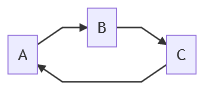

## The problem with circular dependencies

When building an application, good design dictates that you should avoid circular dependencies between your services. A circular dependency is when some components depend on each other, directly or indirectly, e.g. `A` depends on `B` which depends on `C` which depends on `A`:



It is generally agreed that this should be avoided; I won't go into the details of the conceptual and theoretical reasons, because there are plenty of resources about it on the web.

But circular dependencies also have a very concrete effect. If you accidentally introduce a circular dependency in an NET Core app that uses dependency injection, you will know immediately, because the resolution of a component involved in the dependency cycle will fail. For instance, if you have these components:

- `A`, which implements interface `IA` and depends on `IB`
- `B`, which implements interface `IB` and depends on `IC`
- `C`, which implements interface `IC` and depends on `IA`


When you try to resolve `IA`, the dependency injection container will try to create an instance of `A`; to do that, it will need to resolve `IB`, so it will try to create an instance of `B`; to do that, it will need to resolve `IC`, so it will try to create an instance of `C`; and to do that, it will need to resolve `IA`... which was already being resolved. Here you have it: circular dependency. The resolution of `IA` will cannot complete; in fact, .NET Core's built-in IoC container detects this, and throws a helpful exception:


> **System.InvalidOperationException**: A circular dependency was detected for the service of type 'Demo.IA'.


So, clearly, this situation should be avoided.

## Workaround

However, when a real-world app reaches a certain level of complexity, it can sometimes be difficult to avoid. One day, you innocently add a dependency to a service, and things blow up in your face. So you're faced with a choice: refactor a significant part of your app to avoid the dependency cycle, or "cheat".

While, ideally, you would opt for a refactoring, it's not always practical. Because of deadlines, you might not have the time to refactor your code and thoroughly test it for regressions.

Fortunately, if you're willing to incur a bit of technical debt, there's a simple workaround that works in most cases (what I referred to as "cheating" earlier). The trick is to resolve one of the dependencies in the cycle lazily, i.e. resolve it at the last possible moment, when you actually need to use it.

One way to do that is to inject the `IServiceProvider` into your class, and use `services.GetRequiredService<T>()` when you need to use `T`. For instance, the `C` class I mentioned earlier might initially look like this:

```csharp
class C : IC
{
    private readonly IA _a;

    public C(IA a)
    {
        _a = a;
    }

    public void Bar()
    {
        ...
        _a.Foo()
        ...
    }
}
```

To avoid the dependency cycle, you could rewrite it like this:

```csharp
class C : IC
{
    private readonly IServiceProvider _services;

    public C(IServiceProvider services)
    {
        _services = services;
    }

    public void Bar()
    {
        ...
        var a = _services.GetRequiredService<IA>();
        a.Foo();
        ...
    }
}
```

Because it's no longer necessary to resolve `IA` while `C` is being constructed, the cycle is broken (at least during construction), and the problem fixed.

However, I don't really like this approach, because it smells of the [Service Locator pattern](https://en.wikipedia.org/wiki/Service_locator_pattern), which is a known anti-pattern. I see two main issues with it:

- It makes your class depend explicitly on the service provider. This is bad, because your class shouldn't have to know anything about the injection dependency mechanism being used; after all, the app could be using [Pure DI](https://blog.ploeh.dk/2014/06/10/pure-di/), i.e. not use an IoC container at all.
- It hides the dependencies of your class. Instead of having them all clearly declared at the constructor level, you now have just an `IServiceProvider` which doesn't tell you anything about the actual dependencies. You have to scan the code of the class to find them.


## A cleaner workaround

The approach I actually use in this situation takes advantage of the `Lazy<T>` class. You will need the following extension method and class:

```csharp
public static IServiceCollection AddLazyResolution(this IServiceCollection services)
{
    return services.AddTransient(
        typeof(Lazy<>),
        typeof(LazilyResolved<>));
}

private class LazilyResolved<T> : Lazy<T>
{
    public LazilyResolved(IServiceProvider serviceProvider)
        : base(serviceProvider.GetRequiredService<T>)
    {
    }
}
```

Call this new method on your service collection during service registration:

```csharp
services.AddLazyResolution();
```

This enables the resolution of a `Lazy<T>` which will lazily resolve a `T` from the service provider.

In the class that depends on `IA`, inject `Lazy<IA>` instead. When you need to use `IA`, just access the lazy's value:

```csharp
class C : IC
{
    private readonly Lazy<IA> _a;

    public C(Lazy<IA> a)
    {
        _a = a;
    }

    public void Bar()
    {
        ...
        _a.Value.Foo();
        ...
    }
}
```

**Note:** DO NOT access the value in the constructor, just store the `Lazy` itself. Accessing the value in the constructor would eagerly resolve `IA`, which would cause the same problem we were trying to solve.

This solution isn't perfect, but it solves the initial problem without too much hassle, and the dependencies are still clearly declared in the constructor.

