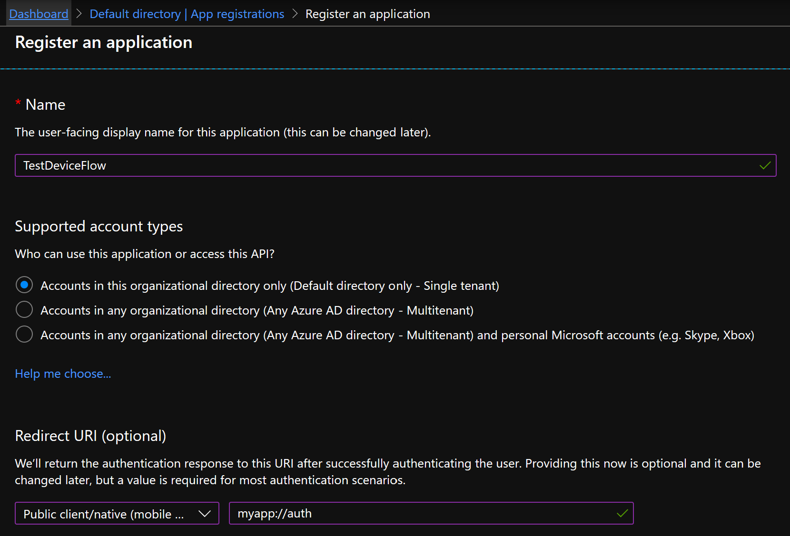
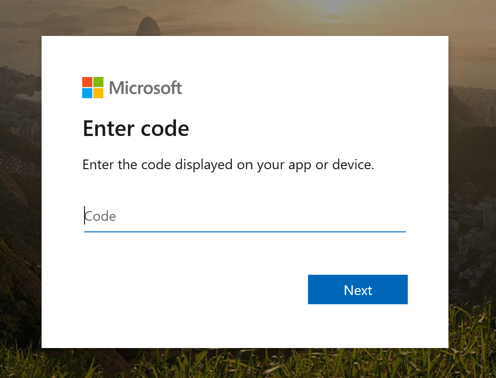

Over the last few years, OpenID Connect has become one of the most common ways to authenticate users in a web application. But if you want to use it in a desktop application, it can be a little awkward…

## Authorization code flow

OpenID Connect is an authentication layer built on top of OAuth 2.0, which means that you have to use one of the OAuth 2.0 authorization flows. A few years ago, there were basically two possible flows that you could use in a desktop client application to authenticate a user:

- [Resource Owner Password Credentials](https://tools.ietf.org/html/rfc6749#section-1.3.3)
- [Authorization Code](https://tools.ietf.org/html/rfc6749#section-1.3.1)


The password flow is pretty easy to use (basically, just exchange the user's login and password for a token), but it requires that the client app is highly trusted, since it gets to manipulate the user's credentials directly. This flow is now [disallowed by OAuth 2.0 Security Best Current Practice](https://tools.ietf.org/html/draft-ietf-oauth-security-topics-13#section-3.4).

The authorization code flow is a bit more complex, but has the advantage that the client application never sees the user's password. The problem is that it requires web navigation with a redirection to the client application, which isn't very practical in a desktop app. There are ways to achieve this, but none of them is perfect. Here are two common ones:

- Open the authorization page in a WebView, and intercept the navigation to the redirect URI to get the authorization code. Not great, because the app *could* get the credentials from the WebView (at least on some platforms), and it requires that the WebView supports intercepting the navigation (probably not possible on some platforms).
- Open the authorization page in the default web browser, and use an application protocol (e.g. `myapp://auth`) associated with the client application for the redirect URI. Unfortunately, a recent Chrome update made this approach impractical, because it [always prompts the user](https://support.google.com/chrome/thread/14193532?hl=en&amp;msgid=14879873) to open the URL in the client application.


In addition, in order to protect against certain attack vectors, it's recommended to use the [PKCE](https://tools.ietf.org/html/rfc7636) extension when using the authorization code grant, which contributes to make the implementation more complex.

Finally, many identity providers require that the client authenticates with its client secret when calling the token endpoint, even though it's not required by the spec (it's only required for confidential clients). This is problematic, since the client app will probably be installed on many machines, and is definitely *not* a confidential client. The user could easily extract the client secret, which is therefore no longer secret.

## An easier way : device flow

Enter device flow (or, more formally, [device authorization grant](https://tools.ietf.org/html/rfc8628)). Device flow is a relatively recent addition to OAuth 2.0 (the first draft was published in 2016), and was designed for connected devices that don't have a browser or have limited user input capabilities. How would you authenticate on such a device if you don't have a keyboard? Well, it's easy: do it on *another* device! Basically, when you need to authenticate, the device will display a URL and a code (it could also display a QR code to avoid having to copy the URL), and start polling the identity provider to ask if authentication is complete. You navigate to the URL in the browser on your phone or computer, log in when prompted to, and enter the code. When you're done, the next time the device polls the IdP, it will receive a token: the flow is complete. The [Azure AD documentation](https://docs.microsoft.com/en-us/azure/active-directory/develop/v2-oauth2-device-code) has a nice sequence diagram that helps understand the flow.

When you think of it, this approach is quite simple, and more straightforward than the more widely used redirection-based flows (authorization code and implicit flow). But what does it have to do with desktop apps, you ask? Well, just because it was designed for input constrained devices doesn't mean you can't use it on a full-fledged computer. As discussed earlier, the redirection-based flows are impractical to use in non-web applications; the device flow doesn't have this problem.

In practice, the client application can directly open the authentication page in the browser, with the code as a query parameter, so the user doesn't need to copy them. The user just needs to sign in with the IdP, give their consent for the application, and it's done. Of course, if the user is already signed in with the IdP and has already given their consent, the flow completes immediately.

The device flow is not very commonly used in desktop apps yet, but you can see it in action in the Azure CLI, when you do `az login`.

## A simple implementation

OK, this post has been a little abstract so far, so let's build something! We're going to create a simple console app that authenticates a user using the device flow.

In this example, I use Azure AD as the identity provider, because it's easy and doesn't require any setup (of course, you could also do this with your IdP of choice, like Auth0, Okta, a custom IdP based on IdentityServer, etc.). Head to the Azure Portal, in the *Azure Active Directory* blade, *App registrations* tab. Create a new registration, give it any name you like, and select *"Accounts in this organizational directory only (Default directory only - Single tenant)"* for the *Supported Account Types* (it would also work in multi-tenant mode, of course, but let's keep things simple for now). Also enter a redirect URI for a public client. It shouldn't be necessary for the device flow, and it won't actually be used, but for some reason, authentication will fail if it's not defined… one of Azure AD's quirks, I guess.



Now, go to the *Authentication* tab of the app, in the *Advanced settings* section, and set *Treat application as a public client* to *Yes*.


And that's all for the app registration part. Just take note of these values in the app's *Overview* tab:

- *Application ID* (client ID in OAuth terminology)
- *Directory ID* (a.k.a. tenant ID; this is your Azure AD tenant)


Now, in our program, the first step is to issue a request to the device code endpoint to start the authorization flow. The [OpenID Connect discovery document](https://login.microsoftonline.com/common/v2.0/.well-known/openid-configuration) on Azure AD is incomplete and doesn't mention the device code endpoint, but it can be found in the documentation. We need to send the client id of our application and the requested scopes. In this case, we use `openid`, `profile` and `offline_access` (to get a refresh token), but in real-world scenario you'll probably need an API scope as well.

```csharp
private const string TenantId = "<your tenant id>";
private const string ClientId = "<your client id>";

private static async Task<DeviceAuthorizationResponse> StartDeviceFlowAsync(HttpClient client)
{
    string deviceEndpoint = $"https://login.microsoftonline.com/{TenantId}/oauth2/v2.0/devicecode";
    var request = new HttpRequestMessage(HttpMethod.Post, deviceEndpoint)
    {
        Content = new FormUrlEncodedContent(new Dictionary<string, string>
        {
            ["client_id"] = ClientId,
            ["scope"] = "openid profile offline_access"
        })
    };
    var response = await client.SendAsync(request);
    response.EnsureSuccessStatusCode();
    var json = await response.Content.ReadAsStringAsync();
    return JsonSerializer.Deserialize<DeviceAuthorizationResponse>(json);
}

private class DeviceAuthorizationResponse
{
    [JsonPropertyName("device_code")]
    public string DeviceCode { get; set; }

    [JsonPropertyName("user_code")]
    public string UserCode { get; set; }

    [JsonPropertyName("verification_uri")]
    public string VerificationUri { get; set; }

    [JsonPropertyName("expires_in")]
    public int ExpiresIn { get; set; }

    [JsonPropertyName("interval")]
    public int Interval { get; set; }
}
```

Let's call this method and open the `verification_uri` from the response in the browser. The user will need to enter the `user_code` in the authorization page.

```csharp
using var client = new HttpClient();
var authorizationResponse = await StartDeviceFlowAsync(client);
Console.WriteLine("Please visit this URL: " + authorizationResponse.VerificationUri);
Console.WriteLine("And enter the following code: " + authorizationResponse.UserCode);
OpenWebPage(authorizationResponse.VerificationUri);
```

This opens the following page:



**Note:** the specs for the device flow mention an optional `verification_uri_complete` property in the authorization response, which includes the `user_code`. Unfortunately, this is not supported by Azure AD, so the user has to enter the code manually.

Now, while the user is entering the code and logging in, we start polling the IdP to get a token. We need to specify `urn:ietf:params:oauth:grant-type:device_code` as the `grant_type`, and provide the `device_code` from the authorization response.

```csharp
var tokenResponse = await GetTokenAsync(client, authorizationResponse);
Console.WriteLine("Access token: ");
Console.WriteLine(tokenResponse.AccessToken);
Console.WriteLine("ID token: ");
Console.WriteLine(tokenResponse.IdToken);
Console.WriteLine("refresh token: ");
Console.WriteLine(tokenResponse.IdToken);

...

private static async Task<TokenResponse> GetTokenAsync(HttpClient client, DeviceAuthorizationResponse authResponse)
{
    string tokenEndpoint = $"https://login.microsoftonline.com/{TenantId}/oauth2/v2.0/token";

    // Poll until we get a valid token response or a fatal error
    int pollingDelay = authResponse.Interval;
    while (true)
    {
        var request = new HttpRequestMessage(HttpMethod.Post, tokenEndpoint)
        {
            Content = new FormUrlEncodedContent(new Dictionary<string, string>
            {
                ["grant_type"] = "urn:ietf:params:oauth:grant-type:device_code",
                ["device_code"] = authResponse.DeviceCode,
                ["client_id"] = ClientId
            })
        };
        var response = await client.SendAsync(request);
        var json = await response.Content.ReadAsStringAsync();
        if (response.IsSuccessStatusCode)
        {
            return JsonSerializer.Deserialize<TokenResponse>(json);
        }
        else
        {
            var errorResponse = JsonSerializer.Deserialize<TokenErrorResponse>(json);
            switch(errorResponse.Error)
            {
                case "authorization_pending":
                    // Not complete yet, wait and try again later
                    break;
                case "slow_down":
                    // Not complete yet, and we should slow down the polling
                    pollingDelay += 5;                            
                    break;
                default:
                    // Some other error, nothing we can do but throw
                    throw new Exception(
                        $"Authorization failed: {errorResponse.Error} - {errorResponse.ErrorDescription}");
            }

            await Task.Delay(TimeSpan.FromSeconds(pollingDelay));
        }
    }
}

private class TokenErrorResponse
{
    [JsonPropertyName("error")]
    public string Error { get; set; }

    [JsonPropertyName("error_description")]
    public string ErrorDescription { get; set; }
}

private class TokenResponse
{
    [JsonPropertyName("access_token")]
    public string AccessToken { get; set; }

    [JsonPropertyName("id_token")]
    public string IdToken { get; set; }

    [JsonPropertyName("refresh_token")]
    public string RefreshToken { get; set; }

    [JsonPropertyName("token_type")]
    public string TokenType { get; set; }

    [JsonPropertyName("expires_in")]
    public int ExpiresIn { get; set; }

    [JsonPropertyName("scope")]
    public string Scope { get; set; }
}
```

When the user completes the login process in the browser, the next call to the token endpoint returns an `access_token`, `id_token` and `refresh_token` (if you requested the `offline_access` scope).

When the access token expires, you can use the refresh token to get a new one, [as described in the specs](https://tools.ietf.org/html/rfc6749#section-6).

## Conclusion

As you can see, the device flow is pretty easy to implement; it's quite straightforward, with no redirection mechanism. Its simplicity also makes it quite secure, with very few angles of attack. In my opinion, it's the ideal flow for desktop or console applications.

You can find the full code for this article [in this repository](https://github.com/thomaslevesque/TestDeviceFlow).

