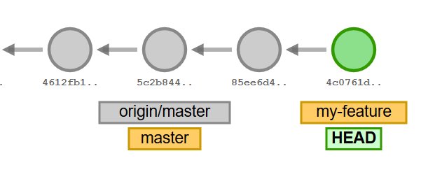

Oh no, you just accidentally commited to `master`, when you were supposed to work on a feature branch! How to fix it? It's actually pretty easy with Git!

A common Git workflow nowadays is the "feature branch" workflow: you can't push directly to the "main" branch (usually `master`, but it can be something else); instead you have to create a branch from `master`, commit to that branch, publish it and submit a pull request.

Now, let's assume that your team follows this workflow, and you accidentally committed to `master`, because you forgot to create your feature branch before you started to work (happens to me all the time!). You're now in this state:


So, you have two problems:
- you can't publish your work, because the server will reject a push to `master`
- you have diverged from the central repo's `master` branch, which will cause issues the next time you try to pull

You need to do two things to fix it:
- move your commit to a new branch
- restore your `master` to it's previous state

This can be done in 3 simple steps.

1. Create the feature branch pointing to your current commit. This way your commit will remain accessible via the branch. Note that we're not switching to the new branch, we're still on `master`.

    ```
    git branch my-feature
    ```

    

2. Reset `master` to its previous state, without touching the working copy (you don't even need to stash your uncommitted changes, but you can if it makes you feel safer).

    ```
    git reset --soft origin/master
    ```

    

3. Checkout your feature branch.

    ```
    git checkout my-feature
    ```

    

You're now back on your feet, and you can keep working as if you never made the mistake in the first place.

Note that this solution only works if you're ahead of your "base branch". If you committed on a completely different branch (e.g. you were on the `foobar` branch, but you were supposed to work on a new feature branched pulled from `master`), the steps to fix will be a bit different. Maybe I'll blog about it another time!

---

*The diagrams in this post are screenshots from [Visualizing Git](https://git-school.github.io/visualizing-git/#free-remote), a great tool to learn Git!*