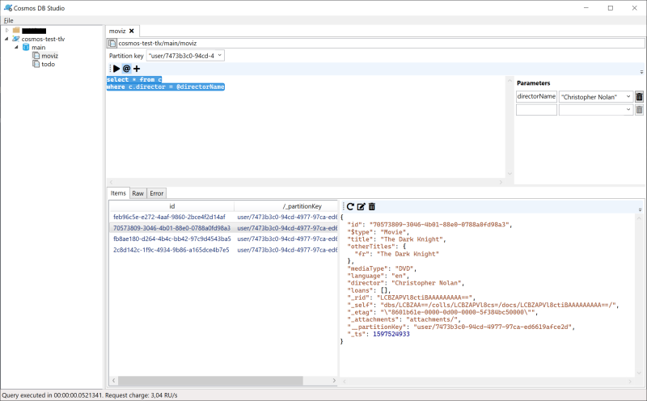

I've been using Azure Cosmos DB on a fairly regular basis for the last 2 years or so. It's a pretty good database, but one thing has always bothered me: the lack of a proper tool to query and modify data in the database. Basically, here are the current options:
- The standalone [Cosmos DB Explorer website](https://cosmos.azure.com/)
- The Data Explorer in the Azure Portal
- Cosmos DB support in Azure Storage Explorer

These 3 options are actually the same thing, made from the same code base, which was recently [open-sourced](https://github.com/Azure/cosmos-explorer). Apart from the Azure Storage Explorer variant, which is badly broken and is being deprecated, they do the job, but they're not very convenient. You can't easily connect to multiple accounts at the same time, and the user experience isn't great.

So I decided to make my own tool: [Cosmos DB Studio](https://github.com/thomaslevesque/CosmosDBStudio). I started it a long time ago and worked very infrequently on it, but in the last few months it began to resemble something usable, so I decided to release a first version of it. It looks like this:

OK, it won't win any design award, but it's functional. On the left, you can see your Cosmos DB accounts, which you can organize in folders. It's a tree view with the structure you'd expect: *Folder > Account > Database > Container*. From there you can:
- add, remove or edit accounts
- create, delete or modify databases and containers
- open a new query sheet on a container

On the right, you have the query sheet view, where you can type SQL queries. To run a query, select it and hit `Ctrl-Enter`. Or just place the caret on the query and hit `Ctrl-Enter`, it will expand the selection to the whole query (multiple queries should be separated by one or more blank lines).

Query results appear at the bottom, with the id and partition key in the list. To see the detail of a document, select it in the list and its content will appear on the right. This view is read-only, but you can click the edit button to edit it (if you selected the whole document, i.e. `select *`).

At the top of the query sheet view, there's a field to enter a partition key, which will apply to all queries you execute. The `@` button opens the parameters panel, where you can enter parameters to use in your queries.

Cosmos DB Studio is still very young and lacks a few features (for instance support for stored procedures, user-defined functions and triggers), but it's good enough to have become my main tool for querying and managing Cosmos databases.

Give it a try and let me know what you think! You can install it [from the store](https://www.microsoft.com/en-us/p/cosmos-db-studio/9mxmw2k8j04h), or [download the package](https://github.com/thomaslevesque/CosmosDBStudio/releases/tag/1.0.1.0) and install via sideloading.