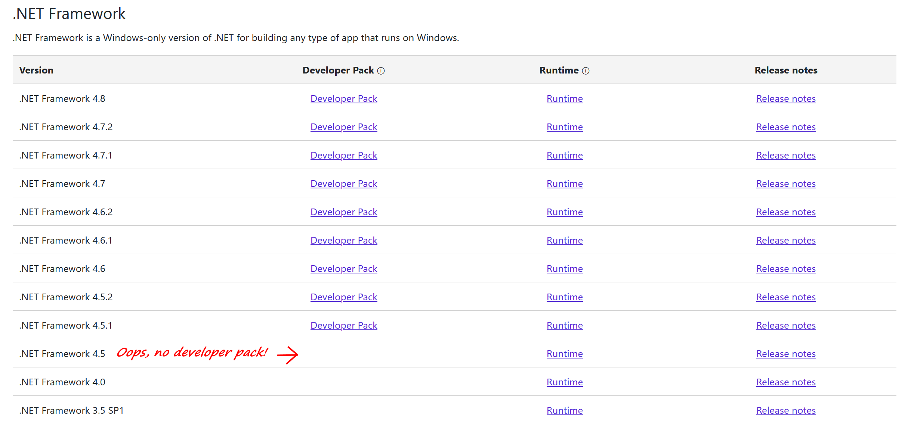

---
layout: post
title: "Building a project that target .NET Framework 4.5 in Visual Studio 2022"
date: 2021-11-12
url: /2021/11/12/building-a-project-that-target-net-45-in-visual-studio-2022/
tags:
  - .NET Framework
  - .NET 4.5
  - Visual Studio 2022
  - Reference assemblies
  - build
---

I maintain a few libraries that still target .NET Framework 4.5 (among others). .NET 4.5 has long been out of support, but I try to keep supporting older frameworks in my libraries as long as it's not a major inconvenience, because many people maintain old applications that can't easily be updated to a newer framework.

Anyway, until recently, supporting .NET 4.5 wasn't much of a problem, but today I hit a snag... Before installing VS 2022 on my Surface Pro, I removed VS 2019 and old versions of .NET (I don't have much space on this machine!). Then, when I tried to build one of my libraries in VS 2022, I started getting this error:

> error MSB3644: The reference assemblies for framework ".NETFramework,Version=v4.5" were not found. To resolve this, install the SDK or Targeting Pack for this framework version or retarget your application to a version of the framework for which you have the SDK or Targeting Pack installed

Strangely, building from the command line with `dotnet build` still works fine.

OK, fine, I'll just install the targeting pack for .NET 4.5 from [this page](https://dotnet.microsoft.com/download/visual-studio-sdks)... Except it isn't there!

For some reason, the oldest version of .NET Framework for which a developer pack is available is 4.5.1. I could just retarget my libraries to .NET Framework 4.5.1, but it's annoying...

Fortunately, there's an easy solution! And it has something to do with why it still works with `dotnet build`... Visual Studio and the .NET CLI actually use a slightly different version of MSBuild. The one used by Visual Studio looks for .NET Framework reference assemblies in `C:\Program Files (x86)\Reference Assemblies\Microsoft\Framework\.NETFramework\v4.5`, which doesn't exist on my machine. The one used by `dotnet build`, on the other hand, gets the reference assemblies from a NuGet package: [Microsoft.NETFramework.ReferenceAssemblies.net45](https://www.nuget.org/packages/microsoft.netframework.referenceassemblies.net45).

So, the fix is simple: just copy the files from that package to `C:\Program Files (x86)\Reference Assemblies\Microsoft\Framework\.NETFramework\v4.5`! Just download the package from NuGet, open it as a zip, and copy the files from `build\.NETFramework\v4.5\`.

And that's it! Visual Studio can now build projects that target .NET Framework 4.5. I hope this helps someone, because I couldn't find any useful information about this on the web!