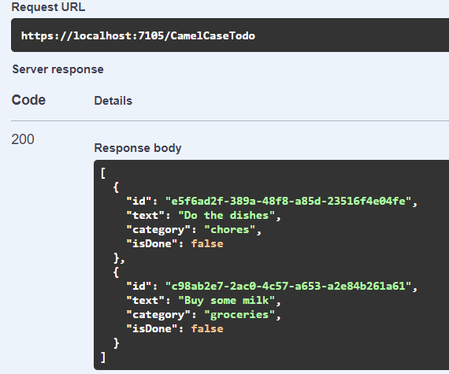
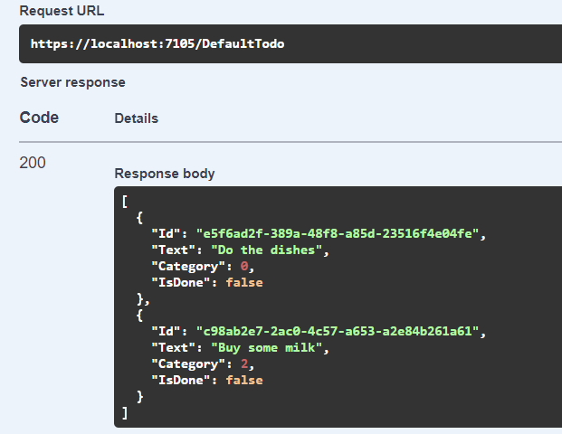

---
layout: post
title: "Using multiple JSON serialization settings in ASP.NET Core"
date: 2022-09-19
url: /2022/09/19/using-multiple-json-serialization-settings-in-aspnet-core/
tags:
  - ASP.NET Core
  - JSON
  - serialization
---

My blog has been a bit quiet in the last 18 months or so, because, well, life happened... In that time span I became a father, changed jobs twice, and relocated to Canada with my family, so free time has been scarce. Anyway, I recently ran into a problem that I found worthy of a blog post, _and_ I have a bit of time to write!

## Heterogenous JSON formats

Let's say we're building an ASP.NET Core Web API that, for some reason, has heterogenous JSON formats: some endpoints use `camelCase` property names and represent enums as strings, others use `PascalCase` and represent enums as integers, maybe some others use `snake_case`... It's a bit of a mess, but let's assume that we don't have a choice in the matter.

We could just decorate the objects exposed by these endpoints with attributes to specify the JSON property names, but it's really annoying... I usually prefer to have a rule that is applied globally, and only use attributes for exceptions to the rule. Basically, what I'd like to do is say "for this controller, use these JSON serialization settings" or "for this endpoint, use those other settings".

Unfortunately, ASP.NET Core only lets us specify global JSON serialization settings, using `.AddControllers().AddJsonOptions(...)`, and these settings are used for all endpoints... I found a few questions on Stack Overflow about this, but none of them had a satisfactory answer. The good news is that ASP.NET Core is highly extensible, which means we can probably customize the behavior to fit our needs (in fact, I don't think I've ever seen a framework that offers that much flexibility; the team at Microsoft really did an amazing job).

## Input and output formatters

In ASP.NET Core, the format for request and response bodies is controlled by input and output formatters: input formatters deserialize the request body, output formatters serialize the response body. There are formatters for different formats, based on the content type: one for JSON, one for XML, one for plain text, etc. For JSON, by default, ASP.NET Core uses `SystemTextJsonInputFormatter` and `SystemTextJsonOutputFormatter`; both of these use the JSON serialization settings defined in `AddJsonOptions`.

In fact, there can even be multiple formatters for the same content type! How does ASP.NET Core pick the one to use? Well, each formatter implements a method to indicate whether it can handle a given request or response; the first one that returns `true` is picked.

We're going to use this to our advantage: we'll add our own formatters (one input/output formatter pair for each JSON format we want to support), and each will only accept to read requests or write responses for a specific format.

## Named JSON settings

First, we need a way to specify multiple JSON serialization settings, and access these settings by name. Fortunately, ASP.NET Core got us covered here, with its [Named Options](https://docs.microsoft.com/en-us/aspnet/core/fundamentals/configuration/options?view=aspnetcore-6.0#named) feature.

The `AddJsonOptions` method just configures `JsonOptions` for the default option name (which is an empty string), but we can also do it for a specific name. In fact, let's write an overload of `AddJsonOptions` to do this:

```csharp
public static IMvcBuilder AddJsonOptions(
    this IMvcBuilder builder,
    string settingsName,
    Action<JsonOptions> configure)
{
    ArgumentNullException.ThrowIfNull(builder);
    ArgumentNullException.ThrowIfNull(configure);
    builder.Services.Configure(settingsName, configure);
    return builder;
}
```

And now we can use the same familiar approach as when configuring the global JSON options, but with a name:

```csharp
builder.Services.AddControllers()
    .AddJsonOptions(options =>
    {
        // Global settings: use the defaults, but serialize enums as strings
        // (because it really should be the default)
        options.JsonSerializerOptions.Converters.Add(
            new JsonStringEnumConverter(JsonNamingPolicy.CamelCase, false));
    })
    .AddJsonOptions("old", options =>
    {
        // Custom JSON format for interop with an old system that uses PascalCase
        // and enums as numbers
        options.JsonSerializerOptions.PropertyNamingPolicy = null;
    });
```

So now we can have global (unnamed) settings, and named settings (`old`). Of course, at this point, nothing uses the `old` settings... we'll get there soon.

## Endpoint metadata

In order to indicate which JSON format is used for a given endpoint, we need to add some metadata to the endpoint. Adding custom metadata to endpoints in ASP.NET Core is pretty easy: any attribute applied to a controller or action is considered metadata. So let's just create a custom attribute:

```csharp
[AttributeUsage(AttributeTargets.Class | AttributeTargets.Method)]
public class JsonSettingsNameAttribute : Attribute
{
    public JsonSettingsNameAttribute(string name)
    {
        Name = name;
    }

    public string Name { get; }
}
```

We can then apply this attribute to a whole controller class, or to a specific action method:

```csharp
[ApiController]
[Route("[controller]")]
// This controller uses the "old" JSON format
[JsonSettingsName("old")]
public class OldApiController : ControllerBase
{
    [HttpGet("foo")]
    public IActionResult Foo() { ... }

    [HttpGet("bar")]
    // This action uses the "blah" JSON format
    [JsonSettingsName("blah")]
    public IActionResult Bar() { ... }
}
```

And we can access the information from the endpoint at runtime like this:

```csharp
public static string? GetJsonSettingsName(this HttpContext context)
{
    return context.GetEndpoint()
        ?.Metadata
        .GetMetadata<JsonSettingsNameAttribute>()
        ?.Name;
}
```

Easy!

## Custom formatters

The next piece of the puzzle is to actually write the custom formatters. This might sound difficult, but it's really not that hard, because we don't need to reimplement the whole thing: we can inherit from the default JSON formatters, and just override the `CanRead` and `CanWriteResult` methods. Our formatters will be created for a specific format, and only handle requests and responses for endpoints that use this format. Here we go:

```csharp
public class SpecificSystemTextJsonInputFormatter : SystemTextJsonInputFormatter
{
    public SpecificSystemTextJsonInputFormatter(string settingsName, JsonOptions options, ILogger<SpecificSystemTextJsonInputFormatter> logger)
        : base(options, logger)
    {
        SettingsName = settingsName;
    }

    public string SettingsName { get; }

    public override bool CanRead(InputFormatterContext context)
    {
        if (context.HttpContext.GetJsonSettingsName() != SettingsName)
            return false;

        return base.CanRead(context);
    }
}

public class SpecificSystemTextJsonOutputFormatter : SystemTextJsonOutputFormatter
{
    public SpecificSystemTextJsonOutputFormatter(string settingsName, JsonSerializerOptions jsonSerializerOptions) : base(jsonSerializerOptions)
    {
        SettingsName = settingsName;
    }

    public string SettingsName { get; }

    public override bool CanWriteResult(OutputFormatterCanWriteContext context)
    {
        if (context.HttpContext.GetJsonSettingsName() != SettingsName)
            return false;
            
        return base.CanWriteResult(context);
    }
}
```

As you can see, the logic here is pretty simple. If the JSON settings name for the current `HttpContext` matches the formatter's settings name, accept it (more accurately, let the base implementation decide to accept it or not). If it doesn't match, reject it.

Note that this isn't the *whole* logic: the formatters still need to be instantiated with the correct `JsonOptions` or `JsonSerializerOptions`. We'll get to this soon.

## Putting it all together

OK, so we now have:
- named JSON settings
- a way to indicate which named settings (if any) apply to an endpoint
- custom input and output formatters that take the JSON settings name into account

We still need to instantiate the formatters and add them to ASP.NET Core's options. This would normally be done in the call to `AddControllers`, like this:

```csharp
services.AddControllers(options =>
{
    options.InputFormatters.Add(...);
    options.OutputFormatters.Add(...);
});
```

However, our formatters have dependencies on other services, so we can't do it directly. We need to use `IConfigureOptions` instead. Andrew Lock explains this very well in [this article](https://andrewlock.net/access-services-inside-options-and-startup-using-configureoptions/).

So let's create a class that implements `IConfigureOptions<MvcOptions>` and adds the formatters for a given format name:

```csharp
public class ConfigureMvcJsonOptions : IConfigureOptions<MvcOptions>
{
    private readonly string _jsonSettingsName;
    private readonly IOptionsMonitor<JsonOptions> _jsonOptions;
    private readonly ILoggerFactory _loggerFactory;

    public ConfigureMvcJsonOptions(
        string jsonSettingsName,
        IOptionsMonitor<JsonOptions> jsonOptions,
        ILoggerFactory loggerFactory)
    {
        _jsonSettingsName = jsonSettingsName;
        _jsonOptions = jsonOptions;
        _loggerFactory = loggerFactory;
    }

    public void Configure(MvcOptions options)
    {
        var jsonOptions = _jsonOptions.Get(_jsonSettingsName);
        var logger = _loggerFactory.CreateLogger<SpecificSystemTextJsonInputFormatter>();
        options.InputFormatters.Insert(
            0,
            new SpecificSystemTextJsonInputFormatter(
                _jsonSettingsName,
                jsonOptions,
                logger));
        options.OutputFormatters.Insert(
            0,
            new SpecificSystemTextJsonOutputFormatter(
                _jsonSettingsName,
                jsonOptions.JsonSerializerOptions));
    }
}
```

The `Configure` method of this class will be called every time the options system needs to build a `MvcOptions` object.

A few things to note:
- We depend on `IOptionsMonitor<JsonOptions>` to be able to access named options (`IOptions<JsonOptions>` doesn't offer this feature)
- We insert our formatters in the first position, because ASP.NET Core tries each formatter in order. If we added ours at the end, it would pick the first compatible formatter, i.e. the default JSON formatter, ignoring our formatter.

Finally, we need to register this `ConfigureMvcJsonOptions` class as a singleton service. We should do this for each settings name. We're going to do this in our `AddJsonOptions` extension method from earlier:

```csharp
public static IMvcBuilder AddJsonOptions(
    this IMvcBuilder builder,
    string settingsName,
    Action<JsonOptions> configure)
{
    ArgumentNullException.ThrowIfNull(builder);
    ArgumentNullException.ThrowIfNull(configure);
    builder.Services.Configure(settingsName, configure);
    builder.Services.AddSingleton<IConfigureOptions<MvcOptions>>(sp =>
    {
        var options = sp.GetRequiredService<IOptionsMonitor<JsonOptions>>();
        var loggerFactory = sp.GetRequiredService<ILoggerFactory>();
        return new ConfigureMvcJsonOptions(settingsName, options, loggerFactory);
    });
    return builder;
}
```

And everything is now in place! If we decorate a controller with `[JsonSettingsName("old")]`, it will use the `old` JSON settings. Other controllers will still use the default one.

You can find the full code with a working example in [this Github repository](https://github.com/thomaslevesque/AspNetCore.SystemTextJson.MultipleSettings):



