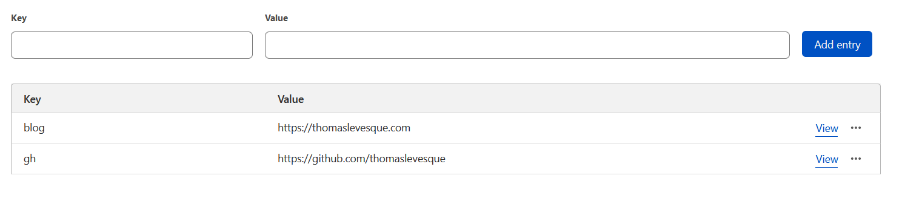

## Cloudflare Workers

[Cloudflare Workers](https://developers.cloudflare.com/workers/) is a serverless environment that runs Javascript. Basically, you just write code that handle HTTP requests, similarly to Node.js. The code is deployed globally across the Cloudflare network, which means it's always running as close as possible to the end user.

I was recently playing with Cloudflare Workers to see how it worked, and I realized how incredibly easy it was to make a simple URL shortener with it! Here's a short tutorial to show you how it can be done.

First, you need a Cloudflare account. Don't worry, it's free! If you need to scale up, you might need a paid plan, but a free plan is enough for experimenting. Once you have your account, login to the dashboard.

## KV Storage

First, we're going to need a storage location for the data. We'll use [Workers KV](https://developers.cloudflare.com/workers/runtime-apis/kv), which is a simple key-value store provided by Cloudflare Workers. Go to the **Workers > KV** section and click **Create namespace**. Choose a name and click **Add**:


Click **View** in the namespace list to access your new namespace, and add a few entries. The key will be the "token" for a short URL, and the value will be the URL it redirects to.



## Creating the worker service

Now, head to the **Workers > Overview** section, and click **Create a service**. Pick a name, select the **HTTP handler** template with the module syntax, and click **Create service**:


You should then be redirected to your new service:


## Binding the KV namespace to a variable

Before we start coding, we need to bind our KV namespace to a variable, so that we can access it from the code. Go to the **Settings** tab, then to the **Variables** section:


Under **KV Namespace Bindings** click **Add binding**, enter `kv` as variable name (you can pick any name you like, of course), pick the KV namespace you created earlier from the dropdown, and click **Save**.


## The code

We are now ready to start coding! Go back to the **Resources** tab, and click the **Quick edit** button. You will land on the code editor page:


On the left is a simple Javascript code editor, and on the right is the UI to test your worker. You can send requests to the worker and check how it responds. This makes it *very* easy to test your code!

Replace the code with the following:

```javascript
export default {
  async fetch(request, env) {

    if (request.method != "GET") {
      return new Response("Forbidden", { status: 403 });
    }

    const { pathname } = new URL(request.url);
    const key = pathname.split('/')[1];
    if (!key) {
      return new Response("Not found", { status: 404 });
    }

    const dest = await env.kv.get(key);
    if (dest) {
      return new Response("Redirecting...", { status: 302, headers: { "Location": dest }});
    }

    return new Response("Not found", { status: 404 });
  }
}
```

Brief explanation of this code:
- We have two parameters:
  - `request`, which, predictably, represents the HTTP request we just received
  - `env`, which gives access to environment variables and KV namespace bindings
- We only want to process `GET` requests, so we return a `403 Forbidden` response if the method isn't `GET`.
- We extract the path from the URL, and get the first path segment; this is the token for the short URL.
- We access the KV namespace to find the destination URL associated with the token.
- If we find it, we return a `302 Found` response to redirect to that URL (specified in the `Location` header)
- Otherwise, we return a `404 Not Found`

## Testing and deploying

You can test it using the **HTTP** panel:


Once you're satisfied that it works, you can deploy by clicking the **Save and deploy** button.

Once it's deployed, you can enter the URL from the test panel directly in your browser's address bar, and you will be redirected to the destination URL.

## Conclusion

We just made a URL shortener in 12 lines of code (not counting blank lines or lines with only braces). Not bad! Of course, it's pretty minimalist, but it's a start. There's no management UI, but you can use the KV editor to add new URLs.

Oh, and of course, for it to be useful as a URL shortener, it needs a domain name that is actually short, but that's out of scope for this post...